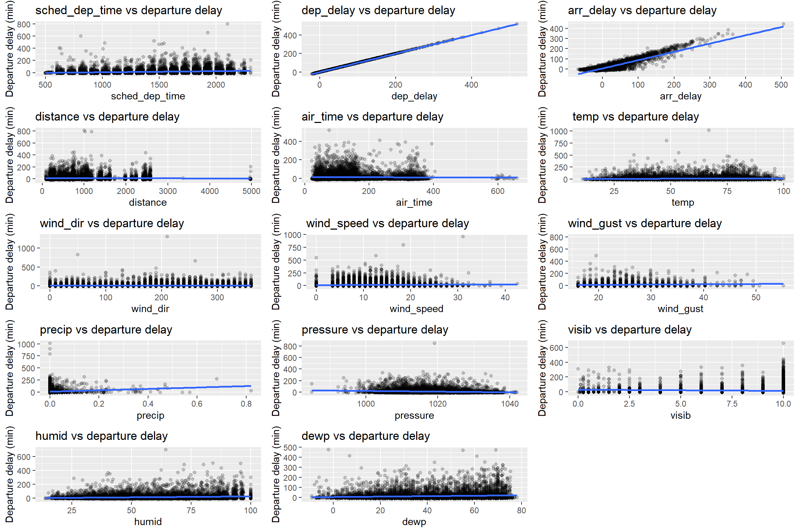

## Introduction

Flight delays are a significant societal problem as they impair
airlines, transport companies, air traffic controllers, facility
managers, and passengers. Studying flight data is an essential activity
for every player involved in the air transportation system. Given the
uncertainty of delays, passengers usually plan to travel many hours
earlier for their appointments. They might have to increase their travel
costs to arrive on time. Airlines suffer penalties, fines, and
additional operation costs, such as airport crew and aircraft retention.
Regarding sustainability, delays may also increase environmental issues
due to increased fuel consumption and gas emissions (Rebollo &
Balakrishnan, 2014; Sternberg et al., 2017;Carvalho et al., 2021).

This project aims to generate a prediction model of departure delay
time. A reliable prediction will benefit airports, airlines, passengers,
and global environmental sustainability.

## Data

Our analysis is based on the public flights dataset taken from the
“nycflights13” R package. This package contains information about all
flights that departed from NYC in 2013. We used additional datasets from
the same package, such as ‘planes’, ‘weather’, and ‘airport’. These
datasets provide extensive information about the flights. ‘planes’
dataset contains construction information about each plane and was
merged with the ‘flights’ dataset by the common variable column
“tailnum”. ‘weather’ dataset, which includes hourly meteorological data
for each airport, was merged with ‘flights’ according to the “origin”
and “time\_hour” variable columns. Similarly, the ‘airports’ dataset,
which represents all involved airports and their locations, was merged
with ‘flights’ by “faa”(=“dest”) variable column. The merged dataset
contains 47 variables and 276688 observations.

     #Load packages:
     options(repos = list(CRAN="http://cran.rstudio.com/"))
    list.of.packages <-
      c(
        "dataPreparation",
        "nycflights13",
        "dplyr",
        "tidyverse",
        "RColorBrewer",
        "ggplot2",
        "lubridate",
        "ROSE",
        "ranger",
        "gridExtra",
        "ranger",
        "ROSE",
        "caret",
        "rpart",
        "rpart.plot",
        "rattle",
        "Metrics",
        "mlr",
        "plotly",
        "caTools",
        "psych"
      )

    new.packages <-
      list.of.packages[!(list.of.packages %in% installed.packages()[, "Package"])]
    if (length(new.packages)) {
      install.packages(new.packages)
    }

    library(dataPreparation)
    library(nycflights13)
    library(dplyr)
    library(tidyverse)
    library(RColorBrewer)
    library(ggplot2)
    library(lubridate)
    library(ROSE)
    library(ranger)
    library(gridExtra)
    library(ranger)
    library(ROSE)
    library(caret)
    library(rpart)
    library(rpart.plot)
    #library(rattle)
    library(Metrics)
    library(mlr)
    library(plotly)
    library(caTools)
    library(psych)
    flights <- flights
    airports <- airports
    planes <- planes
    weather <- weather

    #merged flights + weather + planes + airports(tzone)
    flights_planes <- merge(flights, planes, by = "tailnum")
    flights_planes_weather <-
      merge(flights_planes, weather, by = c("origin", "time_hour"))
    flights_planes_weather <-
      flights_planes %>% right_join(weather, by = c("origin", "time_hour"))
    flights_full <-
      merge(flights_planes_weather,
            airports,
            by.x = c("dest"),
            by.y = c("faa"))

    dim(flights_full)

    ## [1] 276688     47

    head(flights_full)

    ##   dest tailnum year.x month.x day.x dep_time sched_dep_time dep_delay arr_time
    ## 1  ABQ  N637JB   2013       7     9     2004           2007        -3     2247
    ## 2  ABQ  N566JB   2013      12     6     2008           2001         7     2350
    ## 3  ABQ  N563JB   2013      11    25     2014           2000        14     2300
    ## 4  ABQ  N625JB   2013       9    20     2000           2001        -1     2245
    ## 5  ABQ  N547JB   2013       8    18     2006           2007        -1     2226
    ## 6  ABQ  N712JB   2013       9     7     1958           2001        -3     2205
    ##   sched_arr_time arr_delay carrier flight origin air_time distance hour.x
    ## 1           2259       -12      B6   1505    JFK      227     1826     20
    ## 2           2304        46      B6     65    JFK      304     1826     20
    ## 3           2303        -3      B6     65    JFK      263     1826     20
    ## 4           2248        -3      B6     65    JFK      250     1826     20
    ## 5           2259       -33      B6   1505    JFK      235     1826     20
    ## 6           2248       -43      B6     65    JFK      221     1826     20
    ##   minute           time_hour year.y                    type manufacturer
    ## 1      7 2013-07-09 20:00:00   2006 Fixed wing multi engine       AIRBUS
    ## 2      1 2013-12-06 20:00:00   2003 Fixed wing multi engine       AIRBUS
    ## 3      0 2013-11-25 20:00:00   2003 Fixed wing multi engine       AIRBUS
    ## 4      1 2013-09-20 20:00:00   2005 Fixed wing multi engine       AIRBUS
    ## 5      7 2013-08-18 20:00:00   2002 Fixed wing multi engine       AIRBUS
    ## 6      1 2013-09-07 20:00:00   2008 Fixed wing multi engine       AIRBUS
    ##      model engines seats speed    engine year month.y day.y hour.y  temp  dewp
    ## 1 A320-232       2   200    NA Turbo-fan 2013       7     9     20 78.08 71.96
    ## 2 A320-232       2   200    NA Turbo-fan 2013      12     6     20 39.92 35.96
    ## 3 A320-232       2   200    NA Turbo-fan 2013      11    25     20 33.08 12.92
    ## 4 A320-232       2   200    NA Turbo-fan 2013       9    20     20 66.02 59.00
    ## 5 A320-232       2   200    NA Turbo-fan 2013       8    18     20 69.98 60.08
    ## 6 A320-232       2   200    NA Turbo-fan 2013       9     7     20 69.98 57.92
    ##   humid wind_dir wind_speed wind_gust precip pressure visib
    ## 1 81.50      200    8.05546        NA   0.00   1016.1    10
    ## 2 85.61       20   18.41248        NA   0.03   1020.5     5
    ## 3 42.84      230   16.11092        NA   0.00   1028.9    10
    ## 4 78.08      170    8.05546        NA   0.00   1016.8    10
    ## 5 70.81       90    3.45234        NA   0.00   1020.9    10
    ## 6 65.54      200   14.96014        NA   0.00   1014.1    10
    ##                                name      lat       lon  alt tz dst
    ## 1 Albuquerque International Sunport 35.04022 -106.6092 5355 -7   A
    ## 2 Albuquerque International Sunport 35.04022 -106.6092 5355 -7   A
    ## 3 Albuquerque International Sunport 35.04022 -106.6092 5355 -7   A
    ## 4 Albuquerque International Sunport 35.04022 -106.6092 5355 -7   A
    ## 5 Albuquerque International Sunport 35.04022 -106.6092 5355 -7   A
    ## 6 Albuquerque International Sunport 35.04022 -106.6092 5355 -7   A
    ##            tzone
    ## 1 America/Denver
    ## 2 America/Denver
    ## 3 America/Denver
    ## 4 America/Denver
    ## 5 America/Denver
    ## 6 America/Denver

## Exploratory data analysis (EDA) and Pre-Proccessing Analysis

In order to successfully predict a delayed flight we would like to use
the most affecting features/variables in our model and avoid features
that may increase noise. Achieving this goal requires pre-processing
steps in which we reduce the number of variables and the number of
levels/categories in variables.

First, we plotted numeric variables vs. departure delay in order to
visually spot if there is a linear relationship between them. On top of
the scatter plot there is a linear model fit line:

    plot_var_vs_dep_delay <-
      function(var_name, df = numeric_flights_full){
        df <- df[sample(nrow(df), 10000), ]
         p<-ggplot(data = df, mapping = aes(x = get(var_name), y = dep_delay)) +
          geom_point(alpha = 0.2) +
          geom_smooth(method = "lm",level=0.2) +
          labs(
            x = sprintf("%s", var_name),
            y = "Departure delay (min)",
            title = sprintf("%s vs departure delay", var_name))
        return(p)
    }

    numeric_vars <- c(
      'sched_dep_time',
      'dep_delay',
      'arr_delay',
      'distance',
      'air_time',
      'temp',
      'wind_dir',
      'wind_speed',
      'wind_gust',
      "precip",
      "pressure",
      "visib",
      "humid",
      "dewp"
    )
    numeric_flights_full <-
      flights_full[,numeric_vars]

    plot_list <- lapply(numeric_vars, plot_var_vs_dep_delay)

    grid.arrange(grobs = plot_list, ncol = 3)

We would like to examine correlation between numeric variables. In order
to calculate Pearson correlation, certain assumptions must be met; one
of them is that there must be a linear relationship between the
variables. Observing the scatter plots above, we can see there is no
linear relationship between those numeric variables. Thus, we chose to
apply Spearman correlation test, which does not require linear
relationship assumptions.

Thus, we perform Spearman correlation test between numerical variables
in the dataset:

    cor_test_mat <- corr.test(numeric_flights_full, method = "spearman")  
    #r
    cor_test_mat$r

    ##                sched_dep_time    dep_delay   arr_delay     distance
    ## sched_dep_time    1.000000000  0.242468155  0.15972763 -0.020968959
    ## dep_delay         0.242468155  1.000000000  0.63416915  0.076474466
    ## arr_delay         0.159727631  0.634169152  1.00000000 -0.071903136
    ## distance         -0.020968959  0.076474466 -0.07190314  1.000000000
    ## air_time         -0.021874600  0.079279091 -0.02003161  0.984448446
    ## temp              0.078878376  0.046728973 -0.02567579  0.006721989
    ## wind_dir          0.009809660 -0.009695863 -0.01368203  0.001601394
    ## wind_speed        0.123476957  0.065576107  0.07031103  0.019372379
    ## wind_gust         0.050621861  0.036945207  0.06842991  0.030620264
    ## precip            0.009062127  0.116261731  0.15317115  0.003132605
    ## pressure         -0.074564174 -0.113104964 -0.12835539  0.008417160
    ## visib             0.082449488 -0.082294763 -0.12681222 -0.009263453
    ## humid            -0.159960170  0.086862748  0.11285397  0.023404245
    ## dewp             -0.008916716  0.080997447  0.02851065  0.016728963
    ##                    air_time         temp     wind_dir  wind_speed   wind_gust
    ## sched_dep_time -0.021874600  0.078878376  0.009809660  0.12347696  0.05062186
    ## dep_delay       0.079279091  0.046728973 -0.009695863  0.06557611  0.03694521
    ## arr_delay      -0.020031610 -0.025675795 -0.013682031  0.07031103  0.06842991
    ## distance        0.984448446  0.006721989  0.001601394  0.01937238  0.03062026
    ## air_time        1.000000000 -0.049792971  0.011814677  0.02951930  0.04791494
    ## temp           -0.049792971  1.000000000 -0.144816796 -0.11791494 -0.35254088
    ## wind_dir        0.011814677 -0.144816796  1.000000000  0.34195792  0.13169708
    ## wind_speed      0.029519300 -0.117914944  0.341957922  1.00000000  0.87662980
    ## wind_gust       0.047914943 -0.352540879  0.131697082  0.87662980  1.00000000
    ## precip          0.019925058 -0.065799680 -0.083363231  0.04379486  0.08782057
    ## pressure       -0.001528471 -0.239281149 -0.186149803 -0.20058037 -0.21646913
    ## visib          -0.024508213  0.054669345  0.223136647  0.12964654 -0.10737224
    ## humid           0.028202000  0.045535829 -0.351682726 -0.21874997 -0.01924615
    ## dewp           -0.030345953  0.881335226 -0.279280924 -0.19406358 -0.30536777
    ##                      precip     pressure        visib       humid         dewp
    ## sched_dep_time  0.009062127 -0.074564174  0.082449488 -0.15996017 -0.008916716
    ## dep_delay       0.116261731 -0.113104964 -0.082294763  0.08686275  0.080997447
    ## arr_delay       0.153171154 -0.128355394 -0.126812225  0.11285397  0.028510646
    ## distance        0.003132605  0.008417160 -0.009263453  0.02340424  0.016728963
    ## air_time        0.019925058 -0.001528471 -0.024508213  0.02820200 -0.030345953
    ## temp           -0.065799680 -0.239281149  0.054669345  0.04553583  0.881335226
    ## wind_dir       -0.083363231 -0.186149803  0.223136647 -0.35168273 -0.279280924
    ## wind_speed      0.043794856 -0.200580367  0.129646536 -0.21874997 -0.194063580
    ## wind_gust       0.087820566 -0.216469127 -0.107372244 -0.01924615 -0.305367772
    ## precip          1.000000000 -0.081572193 -0.480288221  0.37760322  0.102317758
    ## pressure       -0.081572193  1.000000000  0.128824903 -0.13973204 -0.267869766
    ## visib          -0.480288221  0.128824903  1.000000000 -0.56241399 -0.197036048
    ## humid           0.377603217 -0.139732043 -0.562413993  1.00000000  0.494198023
    ## dewp            0.102317758 -0.267869766 -0.197036048  0.49419802  1.000000000

    #p value
    cor_test_mat$p

    ##                sched_dep_time     dep_delay     arr_delay      distance
    ## sched_dep_time   0.000000e+00  0.000000e+00  0.000000e+00  5.412243e-27
    ## dep_delay        0.000000e+00  0.000000e+00  0.000000e+00  0.000000e+00
    ## arr_delay        0.000000e+00  0.000000e+00  0.000000e+00 1.878316e-306
    ## distance         2.706121e-28  0.000000e+00 4.268899e-308  0.000000e+00
    ## air_time         4.124446e-30  0.000000e+00  1.621108e-25  0.000000e+00
    ## temp             0.000000e+00 1.439739e-131  7.639191e-41  4.065868e-04
    ## wind_dir         3.512590e-07  5.840768e-07  1.942815e-12  4.056914e-01
    ## wind_speed       0.000000e+00 2.529843e-257 1.365972e-294  2.203719e-24
    ## wind_gust        7.008941e-39  4.669118e-21  5.446890e-68  3.120584e-15
    ## precip           1.871206e-06  0.000000e+00  0.000000e+00  9.939732e-02
    ## pressure        1.573520e-300  0.000000e+00  0.000000e+00  2.953352e-05
    ## visib            0.000000e+00  0.000000e+00  0.000000e+00  1.100475e-06
    ## humid            0.000000e+00  0.000000e+00  0.000000e+00  7.787442e-35
    ## dewp             2.728860e-06  0.000000e+00  5.923647e-50  1.368616e-18
    ##                     air_time          temp      wind_dir    wind_speed
    ## sched_dep_time  8.661337e-29  0.000000e+00  3.863849e-06  0.000000e+00
    ## dep_delay       0.000000e+00 5.039086e-130  5.840768e-06 1.011937e-255
    ## arr_delay       3.080106e-24  1.986190e-39  2.525659e-11 5.737081e-293
    ## distance        0.000000e+00  1.626347e-03  8.113828e-01  3.746322e-23
    ## air_time        0.000000e+00 4.464886e-147  1.461914e-08  5.964947e-52
    ## temp           1.240246e-148  0.000000e+00  0.000000e+00  0.000000e+00
    ## wind_dir        1.218262e-09  0.000000e+00  0.000000e+00  0.000000e+00
    ## wind_speed      2.056878e-53  0.000000e+00  0.000000e+00  0.000000e+00
    ## wind_gust       3.391162e-34  0.000000e+00 1.678106e-253  0.000000e+00
    ## precip          2.905854e-25 4.814770e-263  0.000000e+00 1.663411e-117
    ## pressure        4.515856e-01  0.000000e+00  0.000000e+00  0.000000e+00
    ## visib           2.283766e-37 4.125182e-182  0.000000e+00  0.000000e+00
    ## humid           6.461952e-49 6.597392e-127  0.000000e+00  0.000000e+00
    ## dewp            2.344350e-56  0.000000e+00  0.000000e+00  0.000000e+00
    ##                    wind_gust        precip      pressure         visib
    ## sched_dep_time  1.752235e-37  1.309844e-05 6.766138e-299  0.000000e+00
    ## dep_delay       7.470589e-20  0.000000e+00  0.000000e+00  0.000000e+00
    ## arr_delay       1.688536e-66  0.000000e+00  0.000000e+00  0.000000e+00
    ## distance        4.368817e-14  2.981919e-01  1.476676e-04  8.803803e-06
    ## air_time        7.460556e-33  5.230537e-24  8.113828e-01  5.481038e-36
    ## temp            0.000000e+00 1.974056e-261  0.000000e+00 1.567569e-180
    ## wind_dir       6.544614e-252  0.000000e+00  0.000000e+00  0.000000e+00
    ## wind_speed      0.000000e+00 5.489257e-116  0.000000e+00  0.000000e+00
    ## wind_gust       0.000000e+00 3.903508e-112  0.000000e+00 1.238188e-167
    ## precip         1.219846e-113  0.000000e+00  0.000000e+00  0.000000e+00
    ## pressure        0.000000e+00  0.000000e+00  0.000000e+00  0.000000e+00
    ## visib          3.346453e-169  0.000000e+00  0.000000e+00  0.000000e+00
    ## humid           7.196687e-07  0.000000e+00  0.000000e+00  0.000000e+00
    ## dewp            0.000000e+00  0.000000e+00  0.000000e+00  0.000000e+00
    ##                        humid         dewp
    ## sched_dep_time  0.000000e+00 1.637316e-05
    ## dep_delay       0.000000e+00 0.000000e+00
    ## arr_delay       0.000000e+00 1.658621e-48
    ## distance        1.791112e-33 2.052924e-17
    ## air_time        1.744727e-47 7.033051e-55
    ## temp           2.243113e-125 0.000000e+00
    ## wind_dir        0.000000e+00 0.000000e+00
    ## wind_speed      0.000000e+00 0.000000e+00
    ## wind_gust       6.477018e-06 0.000000e+00
    ## precip          0.000000e+00 0.000000e+00
    ## pressure        0.000000e+00 0.000000e+00
    ## visib           0.000000e+00 0.000000e+00
    ## humid           0.000000e+00 0.000000e+00
    ## dewp            0.000000e+00 0.000000e+00

Plot the correlation heatmap

    #plot the correlation matrix
    cor.plot(cor_test_mat$r, main = "Correlation Matrix (spearman)", stars = TRUE, xlas = 2)

The variables ‘dewp’ and ‘temp’ are highly correlated (0.9), so are
‘wind\_speed’ and ‘wind\_gust’ (0.87), and ‘air\_time’ and ‘distance’
(0.98).The correlation is significant (pval&lt;0.05) We decided to
remove ‘dewp’, ‘air\_time’, and ‘wind\_gust’ to avoid double variables
in the model. All three variables are logically an outcome of the
variable they are highly correlated to.

We edited some of the columns in our dataset in order to improve their
potential contribution to the prediction:

Convert hours column to minutes

    flights_full <-
      flights_full %>% mutate(
        sched_dep_time = hour.x * 60 + minute,
        sched_arr_time = floor(sched_arr_time / 100) *
          60 + sched_arr_time %% 100
      )

Convert days to week days

    flights_full <- flights_full %>%
      mutate(w_day = wday(time_hour, label = TRUE))

Convert days to weeks (52 weeks per year)

    flights_full <-
      flights_full %>% mutate(week_num = (year(time_hour) - year(min(time_hour))) * 52 +
                                week(time_hour) - week(min(time_hour)))

Convert wind direction from degrees to 16 compass directions

    directions <- read.csv('../output/wind_directions.csv')

    flights_full <- flights_full %>%
      mutate(wind_dir = cut(
        as.numeric(wind_dir),
        breaks = c(0, directions$degree_max, 360),
        labels = c(directions$cardinal, 'N')
      ))
    #note: when the wind direction is 0 degrees the wd_cardinal is NA.
    #Also, the wind speed is 0.
    #This is correct because if the wind is not moving then it does not have a direction.

Remove NA from dep\_delay

    flights_full <- flights_full %>% drop_na(dep_delay)

Remove sd outliers

    flights_full <-
      remove_sd_outlier(flights_full,
                        cols = "dep_delay",
                        n_sigmas = 7,
                        verbose = TRUE)

    ## [1] "remove_sd_outlier: I start to filter categorical rare events"
    ## [1] "remove_sd_outlier: dropped 548 row(s) that are rare event on dep_delay."
    ## [1] "remove_sd_outlier: 548 have been dropped. It took 0.14 seconds. "

Convert the classes of part of the columns

    flights_full <- transform(
      flights_full,
      origin = as.factor(origin),
      carrier = as.factor(carrier),
      tzone = as.factor(tzone),
      type = as.factor(type),
      model = as.factor(model),
      engine = as.factor(engine),
      hour.y = as.numeric(hour.y),
      hour.x = as.numeric(hour.x),
      manufacturer = as.factor(manufacturer),
      month.x = ordered(as.factor(month.x)),
      month.y = ordered(as.factor(month.y)),
      dest<- as.factor(dest)
    )

Remove identical and constant variables

    #identical columns
    identical(flights_full$hour.x, flights_full$hour.y)

    ## [1] TRUE

    identical(flights_full$month.x, flights_full$month.y)

    ## [1] TRUE

    identical(flights_full$day.x, flights_full$day.y)

    ## [1] TRUE

    #remove identical and constant columns
    flights_full <- fast_filter_variables(
      flights_full,
      level = 2,
      keep_cols = NULL,
      verbose = TRUE
    )

    ## [1] "fast_filter_variables: I check for constant columns."
    ## [1] "fast_filter_variables: I delete 2 constant column(s) in data_set."
    ## [1] "fast_filter_variables: I check for columns in double."
    ## [1] "fast_filter_variables: I delete 3 column(s) that are in double in data_set."

Let’s take a look at the data:

    summary(flights_full)

    ##      dest             tailnum             month.x           day.x      
    ##  Length:271980      Length:271980      10     : 23965   Min.   : 1.00  
    ##  Class :character   Class :character   8      : 23847   1st Qu.: 8.00  
    ##  Mode  :character   Mode  :character   5      : 23608   Median :16.00  
    ##                                        7      : 23563   Mean   :15.69  
    ##                                        3      : 23106   3rd Qu.:23.00  
    ##                                        4      : 23058   Max.   :31.00  
    ##                                        (Other):130833                  
    ##     dep_time    sched_dep_time     dep_delay        arr_time   
    ##  Min.   :   1   Min.   : 300.0   Min.   :-43.0   Min.   :   1  
    ##  1st Qu.: 909   1st Qu.: 545.0   1st Qu.: -5.0   1st Qu.:1103  
    ##  Median :1359   Median : 835.0   Median : -1.0   Median :1536  
    ##  Mean   :1351   Mean   : 814.4   Mean   : 12.5   Mean   :1506  
    ##  3rd Qu.:1750   3rd Qu.:1049.0   3rd Qu.: 11.0   3rd Qu.:1945  
    ##  Max.   :2400   Max.   :1425.0   Max.   :298.0   Max.   :2400  
    ##                                                  NA's   :345   
    ##  sched_arr_time     arr_delay          carrier          flight     origin      
    ##  Min.   :   1.0   Min.   :-86.000   UA     :55437   Min.   :   1   EWR:110190  
    ##  1st Qu.: 681.0   1st Qu.:-17.000   EV     :51015   1st Qu.: 509   JFK: 88371  
    ##  Median : 955.0   Median : -5.000   B6     :49385   Median :1409   LGA: 73419  
    ##  Mean   : 934.9   Mean   :  6.376   DL     :46007   Mean   :1882               
    ##  3rd Qu.:1188.0   3rd Qu.: 14.000   US     :19758   3rd Qu.:3315               
    ##  Max.   :1439.0   Max.   :441.000   9E     :17310   Max.   :8500               
    ##                   NA's   :926       (Other):33068                              
    ##     air_time        distance        hour.x          minute     
    ##  Min.   : 20.0   Min.   :  80   Min.   : 5.00   Min.   : 0.00  
    ##  1st Qu.: 82.0   1st Qu.: 529   1st Qu.: 9.00   1st Qu.: 6.00  
    ##  Median :129.0   Median : 888   Median :13.00   Median :29.00  
    ##  Mean   :152.8   Mean   :1062   Mean   :13.14   Mean   :25.86  
    ##  3rd Qu.:194.0   3rd Qu.:1400   3rd Qu.:17.00   3rd Qu.:42.00  
    ##  Max.   :695.0   Max.   :4983   Max.   :23.00   Max.   :59.00  
    ##  NA's   :926                                                   
    ##    time_hour                       year.y                           type       
    ##  Min.   :2013-01-01 05:00:00   Min.   :1956   Fixed wing multi engine :270051  
    ##  1st Qu.:2013-04-05 16:00:00   1st Qu.:1999   Fixed wing single engine:  1552  
    ##  Median :2013-07-04 09:00:00   Median :2002   Rotorcraft              :   377  
    ##  Mean   :2013-07-03 16:34:46   Mean   :2001                                    
    ##  3rd Qu.:2013-10-01 12:00:00   3rd Qu.:2006                                    
    ##  Max.   :2013-12-30 18:00:00   Max.   :2013                                    
    ##                                NA's   :5054                                    
    ##                         manufacturer               model           engines     
    ##  BOEING                       :79441   A320-232       : 41865   Min.   :1.000  
    ##  EMBRAER                      :63272   EMB-145LR      : 26431   1st Qu.:2.000  
    ##  AIRBUS                       :43742   ERJ 190-100 IGW: 23280   Median :2.000  
    ##  AIRBUS INDUSTRIE             :40039   737-824        : 13320   Mean   :1.994  
    ##  BOMBARDIER INC               :27416   EMB-145XR      : 13299   3rd Qu.:2.000  
    ##  MCDONNELL DOUGLAS AIRCRAFT CO: 8766   CL-600-2D24    : 11666   Max.   :4.000  
    ##  (Other)                      : 9304   (Other)        :142119                  
    ##      seats           speed                  engine            temp       
    ##  Min.   :  2.0   Min.   : 90.0    4 Cycle      :    37   Min.   : 10.94  
    ##  1st Qu.: 55.0   1st Qu.:105.0    Reciprocating:  1648   1st Qu.: 42.08  
    ##  Median :149.0   Median :126.0    Turbo-fan    :230495   Median : 57.92  
    ##  Mean   :136.4   Mean   :152.8    Turbo-jet    : 39380   Mean   : 57.11  
    ##  3rd Qu.:189.0   3rd Qu.:127.0    Turbo-prop   :    43   3rd Qu.: 71.96  
    ##  Max.   :450.0   Max.   :432.0    Turbo-shaft  :   377   Max.   :100.04  
    ##                  NA's   :271073                          NA's   :15      
    ##       dewp           humid           wind_dir        wind_speed    
    ##  Min.   :-9.94   Min.   : 12.74   W      : 28945   Min.   : 0.000  
    ##  1st Qu.:26.06   1st Qu.: 43.75   S      : 28309   1st Qu.: 6.905  
    ##  Median :42.98   Median : 57.33   NW     : 26301   Median :10.357  
    ##  Mean   :41.62   Mean   : 59.29   SW     : 20188   Mean   :10.993  
    ##  3rd Qu.:57.92   3rd Qu.: 74.80   WNW    : 18852   3rd Qu.:13.809  
    ##  Max.   :78.08   Max.   :100.00   (Other):132408   Max.   :42.579  
    ##  NA's   :15      NA's   :15       NA's   : 16977   NA's   :69      
    ##    wind_gust          precip            pressure          visib       
    ##  Min.   :16.11    Min.   :0.000000   Min.   : 983.8   Min.   : 0.000  
    ##  1st Qu.:20.71    1st Qu.:0.000000   1st Qu.:1012.9   1st Qu.:10.000  
    ##  Median :24.17    Median :0.000000   Median :1017.6   Median :10.000  
    ##  Mean   :25.06    Mean   :0.004304   Mean   :1017.9   Mean   : 9.287  
    ##  3rd Qu.:27.62    3rd Qu.:0.000000   3rd Qu.:1022.9   3rd Qu.:10.000  
    ##  Max.   :66.75    Max.   :1.210000   Max.   :1042.1   Max.   :10.000  
    ##  NA's   :207178                      NA's   :29023                    
    ##      name                lat             lon               alt        
    ##  Length:271980      Min.   :21.32   Min.   :-157.92   Min.   :   3.0  
    ##  Class :character   1st Qu.:32.73   1st Qu.: -95.34   1st Qu.:  26.0  
    ##  Mode  :character   Median :36.08   Median : -84.22   Median : 313.0  
    ##                     Mean   :36.01   Mean   : -90.12   Mean   : 591.4  
    ##                     3rd Qu.:41.41   3rd Qu.: -80.15   3rd Qu.: 748.0  
    ##                     Max.   :61.17   Max.   : -68.83   Max.   :6602.0  
    ##                                                                       
    ##        tz            dst                            tzone        w_day      
    ##  Min.   :-10.0   Length:271980      America/Anchorage  :     6   Sun:37893  
    ##  1st Qu.: -6.0   Class :character   America/Chicago    : 55657   Mon:40906  
    ##  Median : -5.0   Mode  :character   America/Denver     :  9837   Tue:40352  
    ##  Mean   : -5.8                      America/Los_Angeles: 43201   Wed:40641  
    ##  3rd Qu.: -5.0                      America/New_York   :158016   Thu:40400  
    ##  Max.   : -5.0                      America/Phoenix    :  4562   Fri:40416  
    ##                                     Pacific/Honolulu   :   701   Sat:31372  
    ##     week_num           V2        
    ##  Min.   : 0.00   LAX    : 15368  
    ##  1st Qu.:13.00   ATL    : 14320  
    ##  Median :26.00   BOS    : 13534  
    ##  Mean   :25.74   MCO    : 13061  
    ##  3rd Qu.:39.00   SFO    : 12639  
    ##  Max.   :51.00   CLT    : 12064  
    ##                  (Other):190994

Suspected columns to have mostly NAs

    length(which(is.na(flights_full$speed)))

    ## [1] 271073

    length(which(is.na(flights_full$wind_gust)))

    ## [1] 207178

### Dividing Departure Delay Variable into 2 Categories - ‘delay’ vs. ‘no delay’

Since we would like to predict if a particular flight will be delayed,
we logically selected a threshold indicating a significant delay on
time - 20 minutes.

Flights that depart earlier than 10 minutes before their scheduled time
(departure delay &lt; -10) were removed from the following analysis
since they may confuse our model and add noise, as we aim to predict
positive delay. Those flights should be included in the analysis in case
of prediction of negative delay.

Here we assume that a flight is considered as delayed only if its
departure time was delayed by 20 minutes or more. A flight is considered
as departed on time, i.e, no delay, if its departure time is in the
range of 10 minutes earlier and until 20 minutes late (not including 20
minutes late).

    #divide the flights into 2 groups according to their dep_delay - flights above 20 min delay, and flights above -10 & until 20 min delay

    flights_full_new_dep_delay <-
      flights_full[which(flights_full$dep_delay > -10),]
    flights_full_arranged <-
      flights_full_new_dep_delay %>% arrange(dep_delay)

    # plot histogram of original dep_delay before changing it into 2 categories with the threshold
    ggplot(flights_full_arranged, aes(x = dep_delay)) +
      geom_histogram(color = "black", fill = "white", bins = 40) +
      geom_vline(aes(xintercept = 20, color = "delay > 20 min"),
                 linetype = "dashed",
                 size = 1.3) +
      
      scale_color_manual(name = "Treshold delay time", values = c("delay > 20 min" = "red")) +
      
      labs(
        x = "Departure delay time [min]",
        y = "counts of flights",
        title = paste('Histogram of departure delay time')
      ) +
      theme(plot.title = element_text(hjust = 0.5, size = 19, face = "bold"))

    # percentage of dep_delay=0
    (length(which(flights_full_arranged$dep_delay < (20)))) / nrow(flights_full_arranged)

    ## [1] 0.7971997

    # percentage of dep_delay=1
    (length(which(flights_full_arranged$dep_delay >= (20)))) / nrow(flights_full_arranged)

    ## [1] 0.2028003

    #change dep_delay column into categories (0 / 1)
    flights_full_arranged <-
      
      flights_full_arranged %>% mutate(dep_delay = case_when(dep_delay < 20 ~ 0,
                                                             dep_delay >= 20 ~ 1))

    #convert dep_delay to factor column
    flights_full_arranged$dep_delay <-
      as.factor(flights_full_arranged$dep_delay)

    #plot flights counts per 2 dep_delay categories
    ggplot(flights_full_arranged, aes(dep_delay, fill = dep_delay)) + geom_bar(fill =
                                                                                 c('#CC6666', '#FFCCCC')) +     #'#660000', '#993333', '#CC6666'"#FFCCCC"
      labs(title = "Flights counts per departure delay category", x = "Departure delay categories") +
      theme(plot.title = element_text(hjust = 0.5, face = "bold"))

Remove irrelevant columns

    flights_full_arranged <-
      select(
        flights_full_arranged,-c(
          time_hour,
          arr_delay,
          flight,
          tailnum,
          arr_time,
          dep_time,
          name,
          lat,
          lon,
          alt,
          tz,
          dst,
          speed,
          wind_gust,
          dewp,
          hour.x,
          minute,
          day.x,
          air_time
        )
      )

    str(flights_full_arranged)

    ## Classes 'data.table' and 'data.frame':   262613 obs. of  26 variables:
    ##  $ dest          : chr  "ABQ" "ABQ" "ABQ" "ABQ" ...
    ##  $ month.x       : Ord.factor w/ 12 levels "1"<"2"<"3"<"4"<..: 5 9 11 10 10 9 7 9 7 5 ...
    ##  $ sched_dep_time: num  1201 1201 1200 1199 1199 ...
    ##  $ dep_delay     : Factor w/ 2 levels "0","1": 1 1 1 1 1 1 1 1 1 1 ...
    ##  $ sched_arr_time: num  1388 1368 1383 1366 1366 ...
    ##  $ carrier       : Factor w/ 16 levels "9E","AA","AS",..: 4 4 4 4 4 4 4 4 4 4 ...
    ##  $ origin        : Factor w/ 3 levels "EWR","JFK","LGA": 2 2 2 2 2 2 2 2 2 2 ...
    ##  $ distance      : num  1826 1826 1826 1826 1826 ...
    ##  $ year.y        : int  2004 2004 2011 2006 2004 2011 2005 2011 2006 2013 ...
    ##  $ type          : Factor w/ 3 levels "Fixed wing multi engine",..: 1 1 1 1 1 1 1 1 1 1 ...
    ##  $ manufacturer  : Factor w/ 35 levels "AGUSTA SPA","AIRBUS",..: 2 2 2 2 2 18 18 18 18 18 ...
    ##  $ model         : Factor w/ 127 levels "150","172E","172M",..: 89 89 89 89 89 109 109 109 109 109 ...
    ##  $ engines       : int  2 2 2 2 2 2 2 2 2 2 ...
    ##  $ seats         : int  200 200 200 200 200 20 20 20 20 20 ...
    ##  $ engine        : Factor w/ 6 levels "4 Cycle","Reciprocating",..: 3 3 3 3 3 3 3 3 3 3 ...
    ##  $ temp          : num  57.9 63 52 60.1 53.1 ...
    ##  $ humid         : num  69.5 70.1 36.3 74.6 48.5 ...
    ##  $ wind_dir      : Factor w/ 16 levels "N","NNE","NE",..: 9 4 13 9 11 15 11 14 10 10 ...
    ##  $ wind_speed    : num  6.9 3.45 18.41 11.51 20.71 ...
    ##  $ precip        : num  0 0 0 0 0 0 0 0 0 0 ...
    ##  $ pressure      : num  1021 1025 1017 1009 1014 ...
    ##  $ visib         : num  10 10 10 10 10 10 10 10 9 6 ...
    ##  $ tzone         : Factor w/ 7 levels "America/Anchorage",..: 3 3 3 3 3 5 5 5 5 5 ...
    ##  $ w_day         : Ord.factor w/ 7 levels "Sun"<"Mon"<"Tue"<..: 2 7 1 7 7 5 3 1 3 4 ...
    ##  $ week_num      : num  20 38 44 41 42 35 29 37 27 21 ...
    ##  $ V2            : Factor w/ 100 levels "ABQ","ACK","ALB",..: 1 1 1 1 1 2 2 2 2 2 ...
    ##  - attr(*, ".internal.selfref")=<externalptr>

### Combine ‘manufacturer’ and ‘model’ Variables

We wanted to check whether the variable ‘model’ is a unique variable.
That is, there are no model names that appear under two different
manufacturers. Our examination revealed a small number of models whose
names are not unique and appear under two different manufacturers. To
overcome this problem, we decided to combine ‘manufacturer’ and ‘model’
columns into one column named ‘manu\_model’ with the aim of reducing the
amount of variables in the dataset. The manu-model column contains
unique names for each model because each model is coupled to its
manufacturer’s name.

Later we checked whether this variable has priority over the
manufacturer variable, and we saw that the variable is equivalent and,
in some cases, even takes on higher importance in the models we run.
Therefore, we will delete the ‘model’ and ‘manufacturer’ columns and
leave the ‘manu-model’ column containing both information.

    # show in how many different manufacturers each model presented
    manufacturer_model_df<-flights_full_arranged %>% group_by(manufacturer, model) %>% summarise(counts=n())
    table_manufacturer_model<-table(manufacturer_model_df$model)
    table_manufacturer_model[table_manufacturer_model>1] # models' prevalence in different manufacturers

    ## 
    ##    A319-112    A319-114    A319-131    A319-132    A320-211    A320-212 
    ##           2           2           2           2           2           2 
    ##    A320-214    A320-232    A321-211    A321-231    A330-223 CL-600-2B19 
    ##           2           2           2           2           2           2 
    ##   FALCON-XP   FALCON XP       MD-88    MD-90-30 
    ##           3           5           2           2

Combine manufacturer and model columns into one column

    manu_model <-
      paste(flights_full_arranged$manufacturer,
            flights_full_arranged$model,
            sep = "_")
    flights_full_arranged$manu_model <- manu_model

### Plots of normalized delayed flights counts per variable’s categories

In order to visually check whether a variable demonstrates variability
in delayed flights (in cases when dep\_delay=1), we created a bar plot
for each variable separately while considering the number of flights in
each category. Thus, for each category in a given variable we calculated
the relative amount of delayed flights out of total flights in the
current category. Due to this calculation, we can compare the
categories.

    flights_full_arranged_factors_all <-
      data.frame(lapply(flights_full_arranged, factor))
    str(flights_full_arranged_factors_all)

    ## 'data.frame':    262613 obs. of  27 variables:
    ##  $ dest          : Factor w/ 100 levels "ABQ","ACK","ALB",..: 1 1 1 1 1 2 2 2 2 2 ...
    ##  $ month.x       : Ord.factor w/ 12 levels "1"<"2"<"3"<"4"<..: 5 9 11 10 10 9 7 9 7 5 ...
    ##  $ sched_dep_time: Factor w/ 1011 levels "300","301","305",..: 871 871 870 869 869 389 399 389 150 370 ...
    ##  $ dep_delay     : Factor w/ 2 levels "0","1": 1 1 1 1 1 1 1 1 1 1 ...
    ##  $ sched_arr_time: Factor w/ 1102 levels "1","2","3","4",..: 1051 1031 1046 1029 1029 442 459 442 212 430 ...
    ##  $ carrier       : Factor w/ 16 levels "9E","AA","AS",..: 4 4 4 4 4 4 4 4 4 4 ...
    ##  $ origin        : Factor w/ 3 levels "EWR","JFK","LGA": 2 2 2 2 2 2 2 2 2 2 ...
    ##  $ distance      : Factor w/ 205 levels "80","94","96",..: 179 179 179 179 179 14 14 14 14 14 ...
    ##  $ year.y        : Factor w/ 46 levels "1956","1959",..: 37 37 44 39 37 44 38 44 39 46 ...
    ##  $ type          : Factor w/ 3 levels "Fixed wing multi engine",..: 1 1 1 1 1 1 1 1 1 1 ...
    ##  $ manufacturer  : Factor w/ 35 levels "AGUSTA SPA","AIRBUS",..: 2 2 2 2 2 18 18 18 18 18 ...
    ##  $ model         : Factor w/ 127 levels "150","172E","172M",..: 89 89 89 89 89 109 109 109 109 109 ...
    ##  $ engines       : Factor w/ 4 levels "1","2","3","4": 2 2 2 2 2 2 2 2 2 2 ...
    ##  $ seats         : Factor w/ 48 levels "2","4","5","6",..: 34 34 34 34 34 13 13 13 13 13 ...
    ##  $ engine        : Factor w/ 6 levels "4 Cycle","Reciprocating",..: 3 3 3 3 3 3 3 3 3 3 ...
    ##  $ temp          : Factor w/ 167 levels "10.94","12.02",..: 101 112 82 105 85 132 143 122 132 120 ...
    ##  $ humid         : Factor w/ 2431 levels "12.74","13","13.95",..: 1807 1822 672 1938 1152 1141 1808 923 1988 2028 ...
    ##  $ wind_dir      : Factor w/ 16 levels "N","NNE","NE",..: 9 4 13 9 11 15 11 14 10 10 ...
    ##  $ wind_speed    : Factor w/ 34 levels "0","3.45234",..: 5 2 15 9 17 11 10 13 7 9 ...
    ##  $ precip        : Factor w/ 55 levels "0","0.01","0.02",..: 1 1 1 1 1 1 1 1 1 1 ...
    ##  $ pressure      : Factor w/ 453 levels "983.8","985",..: 258 296 215 141 193 203 85 127 237 242 ...
    ##  $ visib         : Factor w/ 20 levels "0","0.06","0.12",..: 20 20 20 20 20 20 20 20 19 16 ...
    ##  $ tzone         : Factor w/ 7 levels "America/Anchorage",..: 3 3 3 3 3 5 5 5 5 5 ...
    ##  $ w_day         : Ord.factor w/ 7 levels "Sun"<"Mon"<"Tue"<..: 2 7 1 7 7 5 3 1 3 4 ...
    ##  $ week_num      : Factor w/ 52 levels "0","1","2","3",..: 21 39 45 42 43 36 30 38 28 22 ...
    ##  $ V2            : Factor w/ 100 levels "ABQ","ACK","ALB",..: 1 1 1 1 1 2 2 2 2 2 ...
    ##  $ manu_model    : Factor w/ 147 levels "AGUSTA SPA_A109E",..: 23 23 23 23 23 122 122 122 122 122 ...

    gplot_var <- function(var_name, convert_x, palette_a = FALSE) {
      count_df_var <-
        flights_full_arranged_factors_all %>% group_by(!!(sym(var_name))) %>% summarize(total_count =
                                                                                          n())
      df_var <-
        flights_full_arranged_factors_all %>% group_by(!!(sym(var_name)), dep_delay) %>% tally() %>% filter(dep_delay ==
                                                                                                              1)
      df_var <- merge(df_var, count_df_var, by = var_name)
      df_var <- df_var %>% mutate(relative_count_1 = n / total_count)
      varX <- paste(var_name, ".x", sep = "")
      colnames(df_var)[which(colnames(df_var) == varX)] <- var_name
      g <-
        ggplot(
          data = df_var,
          mapping = aes_string(x = var_name, y = "relative_count_1", fill = var_name)
        ) + geom_bar(stat = "identity", show.legend = FALSE) +
        labs(
          fill = var_name,
          x = var_name,
          y = 'Normalized count delayed flights',
          title = paste("Normalized count delayed flights per category in", var_name)
        )
      if (convert_x == TRUE) {
        t <- theme(
          plot.title = element_text(
            hjust = 0.5,
            size = 19,
            face = "bold"
          ),
          axis.text.x = element_text(
            angle = 90,
            vjust = 0.5,
            hjust = 1,
            size = 6
          )
        )
      } else {
        t <- theme(
          plot.title = element_text(
            hjust = 0.5,
            size = 19,
            face = "bold"
          ),
          axis.text.x = element_text(size = 6)
        )
      }
      if (!(palette_a == FALSE)) {
        color <- scale_fill_brewer(palette = palette_a)
        g + t + color
      } else {
        g + t
      }
    }

Destination

    # plot normalized delayed flights in destination variable
    dest_plot<-gplot_var("dest", convert_x=TRUE)                                                                        
    dest_plot

Origin Airport

    # plot normalized delayed flights in origin variable
    origin_plot<-gplot_var("origin", convert_x=FALSE, palette_a="PuRd")                                                                    
    origin_plot

Month

    # plot normalized delayed flights in month variable
    colnames(flights_full_arranged_factors_all)[which(colnames(flights_full_arranged_factors_all)=="month.x")]<-"month"
    month_plot<-gplot_var("month", convert_x=FALSE)                                                                        
    month_plot

Carrier (airline)

    # plot normalized delayed flights in carrier variable
    carrier_plot<-gplot_var("carrier", convert_x=FALSE)                                                                        
    carrier_plot

Year of Manufacturer

    # plot normalized delayed flights in year variable
    colnames(flights_full_arranged_factors_all)[which(colnames(flights_full_arranged_factors_all)=="year.y")]<-"year"
    year_plot<-gplot_var("year", convert_x=TRUE)                                                                        
    year_plot

Engine Type

    # plot normalized delayed flights in type variable
    type_plot<-gplot_var("type", convert_x=FALSE, palette_a="Oranges")                                                                    
    type_plot

Manufacture

    # plot normalized delayed flights in manufacturer variable
    manufacturer_plot<-gplot_var("manufacturer", convert_x=TRUE)                                                                        
    manufacturer_plot

Model

    # plot normalized delayed flights in model variable
    model_plot<-gplot_var("model", convert_x=TRUE)                                                                        
    model_plot

Number of Engines

    # plot normalized delayed flights in engines variable
    engines_plot<-gplot_var("engines", convert_x=FALSE, palette_a="BuGn")                                                                  
    engines_plot

Visibility

    # plot normalized delayed flights in visib variable
    visib_plot<-gplot_var("visib", convert_x=FALSE)                                                                        
    visib_plot

Time Zone

    # plot normalized delayed flights in tzone variable
    tzone_plot<-gplot_var("tzone", convert_x=TRUE, palette_a="RdPu")                                                                    
    tzone_plot

Week Day

    # plot normalized delayed flights in w_day variable
    w_day_plot<-gplot_var("w_day", convert_x=FALSE, palette_a="YlGn")                                                                     
    w_day_plot

Week Number

    # plot normalized delayed flights in week_num variable
    week_num_plot<-gplot_var("week_num", convert_x=FALSE)                                                                        
    week_num_plot

Manu- Model

    # plot normalized delayed flights in manu_model variable
    manu_model_plot<-gplot_var("manu_model", convert_x=TRUE)                                                                        
    manu_model_plot

    c

    ## function (...)  .Primitive("c")

### Plot Multiple Variables

We have seen that overall there is not one particular variable that has
an apparent direct relationship to the departure delay. The following
plot aims to examine the option of multiple variables together having a
more apparent relation to the departure delay.

    wind_dir_df<- flights_full_arranged %>% group_by(origin, wind_dir) %>% summarize(total_count=n(), mean_speed = mean(wind_speed))
    df_wind<-flights_full_arranged %>% group_by(wind_dir, dep_delay) %>% tally() %>% filter(dep_delay==1, !is.na(wind_dir)) 
    df_wind<-merge(df_wind, wind_dir_df, by= 'wind_dir')
    df_wind <- df_wind %>% mutate(relative_count_1=n/total_count)

    ggplot(df_wind, aes(x = wind_dir, y = relative_count_1, fill = mean_speed)) +
      geom_col(binwidth = 15,
               boundary = -7.5,
               position = 'stack') +
      coord_polar(theta = "x", direction = 2) +
      facet_wrap( ~ origin, nrow = 1) +
      labs(x = "Wind Direction",
           y = 'normalized delay (num delay/total flights)',
           title = "Departure Delay and Wind Speed per Wind Direction and Origin",
           fill = 'Ave. Wind Speed [mph]') +
      theme(plot.title = element_text(face = "bold.italic", hjust = 0.5)) +
      scale_fill_distiller(palette = 'YlOrRd', direction = 1)

### Categories Reduction in Factorial Variables using Permutation Test

In order to optimize our model, we decreased the number of categories
(levels) in factorial variables that are identified with a large number
of categories. This step was performed using a statistical permutation
test on each variable separately. Our assumption is that in a particular
variable, a category that belongs to a delayed flight, not by chance,
should be considered individually in our model since it can indicate the
possibility of delay of a future flight related to this category.
However, a category that repeats on random realizations with the same or
even larger prevalence of delayed flights will probably fail to reject
the null hypothesis that delayed flights are not over-represented in the
current category in the original dataset. Thus, the insignificant
categories of a variable should be combined into one aggregated
category.

We performed 2000 realizations of the original dataset: During each
realization, we randomly shuffled the departure time delay
(‘dep\_delay’) column and counted how many flights labeled as delayed
(with dep\_delay=1) for each category in each variable separately. Next,
we compared it to the original count of departure delayed flights in the
particular category. The P-value for a given category was calculated as
the number of realizations when the count of departure delayed flights
was equal to or even higher than the original delayed flights count in
this category (plus one), divided by the total number of realizations.
For example, a permutation analysis p-value of 1e-3 (in case of 1000
total realizations) means that the null hypothesis was rejected in all
the realizations, suggesting that the specific category is significant
in distinguishing delayed flights in the original dataset, using a
confidence of 0.005. Finally, the permutation analysis p-value was
corrected for multiple testing using the Benjamini-Hochberg procedure.

The P-value for a given category was calculated as the number of
realizations when the count of departure delayed flights was equal to or
higher than the original delayed flights count in this category (plus
one), divided by the total number of realizations. For example, a
permutation analysis p-value of 1e-3 (in case of 1000 total
realizations) means that the null hypothesis was rejected in all the
realizations, suggesting that the specific category is significant in
distinguishing delayed flights in the original dataset, using a
confidence of 0.005. Finally, the permutation analysis p-value was
corrected for multiple testing using the Benjamini-Hochberg procedure.

We applied this step to several variables: \* “model” variable, which
included 127 categories, and after the permutation test had only 13
categories. \* “manufacturer” variable, which initially had 35
categories and finally had 4. \* “manu\_model” included 147 categories
at the beginning and 12 at the end of the permutation test. \* “seats”
included 48 categories at the beginning and 8 at the end of the
permutation test. \* “dest” variable included at first 100 categories,
and after the permutation test had only 52 categories.

We provide in this project the complete output data frames observed from
the permutation analysis. There are 5 data frames - each variable has
its own data frame that includes the number of realizations (plus one)
in which delayed flight counts were equal to or higher than the original
counts for each category. We visualized the results for each variable in
bar plots representing p-value adjusted values (after Benjamini-Hochberg
correction) of each category. A line representing FDR=0.05 is presented
on the plot as well in order to emphasize cases (categories) when the
null hypothesis was rejected. In addition, we generated plots of total
flights in each category to compare p-value results to the total amount
of flights in each category.

    # permutation function
    levels_model <-
      levels(factor(flights_full_arranged$model)) #levels of model
    levels_manufacturer <-
      levels(factor(flights_full_arranged$manufacturer)) #levels of manufacturer
    levels_manu_model <-
      levels(factor(flights_full_arranged$manu_model)) #levels of manu_model
    levels_dest <-
      levels(factor(flights_full_arranged$dest)) #levels of destinations
    levels_seats <-
      levels(factor(flights_full_arranged$seats)) #levels of seats

    run_permutations = FALSE

    if (run_permutations) {
      origin_num_delay_var <- function(var_name, levels_var) {
        origin_delay_vec <-
          sapply(
            levels_var,
            simplify = TRUE,
            FUN = function(one_level) {
              df_summarize <-
                flights_full_arranged %>% filter((!!sym(var_name)) == one_level) %>% group_by(dep_delay, .drop =
                                                                                                FALSE) %>% tally
              number_delay_in_level <-
                df_summarize$n[df_summarize$dep_delay == 1]
              number_delay_in_level
            }
          )
        origin_delay_vec
      }
      
      origin_num_delay_model <-
        origin_num_delay_var('model', levels_model)
      origin_num_delay_manufacturer <-
        origin_num_delay_var('manufacturer', levels_manufacturer)
      origin_num_delay_manu_model <-
        origin_num_delay_var('manu_model', levels_manu_model)
      origin_num_delay_dest <- origin_num_delay_var('dest', levels_dest)
      origin_num_delay_seats <-
        origin_num_delay_var('seats', levels_seats)
      
      
      perm_vec_var <- function(levels_var_model,
                               origin_num_delay_var) {
        perm_vec <- rep(1, length(levels_var_model))
        perm_vec <- setNames(perm_vec, names(origin_num_delay_var))
      }
      
      perm_ndelay_vec_model <-
        perm_vec_var(levels_model, origin_num_delay_model)
      perm_ndelay_vec_manufacturer <-
        perm_vec_var(levels_manufacturer, origin_num_delay_manufacturer)
      perm_ndelay_vec_manu_model <-
        perm_vec_var(levels_manu_model, origin_num_delay_manu_model)
      perm_ndelay_vec_dest <-
        perm_vec_var(levels_dest, origin_num_delay_dest)
      perm_ndelay_vec_seats <-
        perm_vec_var(levels_seats, origin_num_delay_seats)
      
      create_perm_ndelay_vec_var <-
        function(flights_full_perm,
                 var_name,
                 levels_var,
                 origin_num_delay_var,
                 perm_vec_var) {
          perm_num_delay_var <-
            sapply(
              levels_var,
              simplify = TRUE,
              FUN = function(one_level) {
                df_summarize <-
                  flights_full_perm %>% filter((!!sym(var_name)) == one_level) %>% group_by(dep_delay, .drop =
                                                                                              FALSE) %>% tally
                number_delay_in_level <-
                  df_summarize$n[df_summarize$dep_delay == 1]
                number_delay_in_level
              }
            )
          ind_greater <- which(perm_num_delay_var >= origin_num_delay_var)
          perm_vec_var[ind_greater] <- perm_vec_var[ind_greater] + 1
          perm_vec_var
        }
      
      num_perm <- 2000
      for (iter in 1:num_perm) {
        print(iter)
        flights_full_perm <-
          transform(flights_full_arranged, dep_delay = sample(dep_delay))
        perm_ndelay_vec_model <-
          create_perm_ndelay_vec_var(
            flights_full_perm,
            'model',
            levels_model,
            origin_num_delay_model,
            perm_ndelay_vec_model
          )
        perm_ndelay_vec_manufacturer <-
          create_perm_ndelay_vec_var(
            flights_full_perm,
            'manufacturer',
            levels_manufacturer,
            origin_num_delay_manufacturer,
            perm_ndelay_vec_manufacturer
          )
        perm_ndelay_vec_manu_model <-
          create_perm_ndelay_vec_var(
            flights_full_perm,
            'manu_model',
            levels_manu_model,
            origin_num_delay_manu_model,
            perm_ndelay_vec_manu_model
          )
        perm_ndelay_vec_dest <-
          create_perm_ndelay_vec_var(
            flights_full_perm,
            'dest',
            levels_dest,
            origin_num_delay_dest,
            perm_ndelay_vec_dest
          )
        perm_ndelay_vec_seats <-
          create_perm_ndelay_vec_var(
            flights_full_perm,
            'seats',
            levels_seats,
            origin_num_delay_seats,
            perm_ndelay_vec_seats
          )
      }
      
      #save perm_ndelay_vec_var output from permutations to csv (as tibble data frmae)
      perm_ndelay_vec_model_df = tibble(name = names(perm_ndelay_vec_model), value = perm_ndelay_vec_model)
      write.table(
        perm_ndelay_vec_model_df ,
        file = "../output/perm_ndelay_vec_model_df.csv",
        sep = ",",
        row.names = FALSE
      )
      perm_ndelay_vec_manufacturer_df = tibble(name = names(perm_ndelay_vec_manufacturer),
                                               value = perm_ndelay_vec_manufacturer)
      write.table(
        perm_ndelay_vec_manufacturer_df ,
        file = "../output/perm_ndelay_vec_manufacturer_df.csv",
        sep = ",",
        row.names = FALSE
      )
      perm_ndelay_vec_manu_model_df = tibble(name = names(perm_ndelay_vec_manu_model),
                                             value = perm_ndelay_vec_manu_model)
      write.table(
        perm_ndelay_vec_manu_model_df ,
        file = "../output/perm_ndelay_vec_manu_model_df.csv",
        sep = ",",
        row.names = FALSE
      )
      perm_ndelay_vec_dest_df = tibble(name = names(perm_ndelay_vec_dest), value = perm_ndelay_vec_dest)
      write.table(
        perm_ndelay_vec_dest_df ,
        file = "../output/perm_ndelay_vec_dest_df.csv",
        sep = ",",
        row.names = FALSE
      )
      perm_ndelay_vec_seats_df = tibble(name = names(perm_ndelay_vec_seats), value = perm_ndelay_vec_seats)
      write.table(
        perm_ndelay_vec_seats_df ,
        file = "../output/perm_ndelay_vec_seats_df.csv",
        sep = ",",
        row.names = FALSE
      )
      
      
    }

Load output data frames of permutation test and display plots of p-val
and of flights count for each level

    num_perm <- 2000
    perm_result_var_df <- function(var_name) {
      perm_ndelay_var_df <-
        read.table(
          file = paste(
            "../output/perm_ndelay_merged_vec_",
            var_name,
            "_df.csv",
            sep = ""
          ),
          sep = ",",
          header = TRUE
        )
      colnames(perm_ndelay_var_df)[1] <- var_name
      perm_ndelay_var_df$p_val <- perm_ndelay_var_df$value / num_perm
      perm_ndelay_var_df$p_adj <-
        p.adjust(perm_ndelay_var_df$p_val, method = "BH")
      
      flights_counts_var_df <-
        flights_full_arranged %>% group_by((!!sym(var_name))) %>% summarise(total_counts =
                                                                              n())
      perm_ndelay_var_df <-
        merge(perm_ndelay_var_df, flights_counts_var_df, by = var_name) #add flights counts per level
      
      perm_ndelay_var_df <- perm_ndelay_var_df %>% arrange(p_adj)
      
      p_val_plot <-
        ggplot(perm_ndelay_var_df, aes(x = reorder((!!sym(
          var_name
        )), p_adj) , y = p_adj)) + geom_bar(stat = "identity") +
        labs(
          title = paste("p-value adjusted per", var_name, "level"),
          x = var_name,
          y = "p-value adjusted"
        ) +
        theme(
          plot.title = element_text(
            hjust = 0.5,
            size = 19,
            face = "bold"
          ),
          axis.text.x = element_text(
            angle = 90,
            vjust = 0.5,
            hjust = 1,
            size = 6
          )
        ) +
        geom_hline(aes(yintercept = 0.05, color = "0.05"),
                   linetype = "dashed",
                   size = 1.5) +
        scale_color_manual(name = "FDR cutoff", values = c("0.05" = "red"))
      
      flights_counts_plot <-
        ggplot(perm_ndelay_var_df,  aes(x = reorder((!!sym(
          var_name
        )), p_adj) , y = total_counts)) +
        geom_bar(stat = "identity") + labs(
          title = paste("flights counts per", var_name, "level"),
          x = var_name,
          y = "flights counts"
        ) +
        theme(
          plot.title = element_text(
            hjust = 0.5,
            size = 19,
            face = "bold"
          ),
          axis.text.x = element_text(
            angle = 90,
            vjust = 0.5,
            hjust = 1,
            size = 6
          )
        )
      
      return(list(perm_ndelay_var_df, p_val_plot, flights_counts_plot))
    }

Permutation - model

    perm_model_df <- perm_result_var_df("model")
    perm_ndelay_model_df <- perm_model_df[[1]]
    perm_model_df[[2]]

    perm_model_df[[3]]

Permutation - manufacturer

    perm_manufacturer_df <- perm_result_var_df("manufacturer")
    perm_ndelay_manufacturer_df <- perm_manufacturer_df[[1]]
    perm_manufacturer_df[[2]]

    perm_manufacturer_df[[3]]

Permutation - manu\_model

    perm_manu_model_df <- perm_result_var_df("manu_model")
    perm_ndelay_manu_model_df <- perm_manu_model_df[[1]]
    perm_manu_model_df[[2]]

    perm_manu_model_df[[3]]

Permutation - dest

    perm_dest_df <- perm_result_var_df("dest")
    perm_ndelay_dest_df <- perm_dest_df[[1]]
    perm_dest_df[[2]]

    perm_dest_df[[3]]

Permutation - seats

    perm_seats_df <- perm_result_var_df("seats")
    perm_ndelay_seats_df <- perm_seats_df[[1]]
    perm_seats_df[[2]]

    perm_seats_df[[3]]

Following the permutation test and its visualization, in each variable
column (5 variables), we replaced the original levels (categories) with
new levels. Those who passed the Benjamini-Hochberg multiple test
correction (FDR&lt;0.05) were kept, while the insignificant categories
were converted to a single new category named ‘other’. Categories in
‘model’, ‘manufacturer’, and ‘manu\_model’ variables were changed to
one-letter levels, as well as ‘dest’ variable, whose categories were
replaced with numbers for visualization improvement purposes.

Change model levels in flights\_full\_arranged

    flights_full_arranged$model <-
      as.character(flights_full_arranged$model)
    models_to_change <-
      perm_ndelay_model_df$model[which(perm_ndelay_model_df$p_adj <= 0.05)] #filtered levels (were kept)
    models_to_change

    ##  [1] "717-200"     "737-7H4"     "757-324"     "CL-600-2B19" "CL-600-2C10"
    ##  [6] "CL-600-2D24" "EMB-145"     "EMB-145LR"   "EMB-145XR"   "A319-115"   
    ## [11] "777-224"     "737-7BD"

    flights_full_arranged <-
      flights_full_arranged %>% mutate(model = replace(
        model,!(flights_full_arranged$model %in% models_to_change),
        'other'
      ))

    flights_full_arranged$model <-
      as.factor(flights_full_arranged$model) #convert back to factor variable
    levels(flights_full_arranged$model)

    ##  [1] "717-200"     "737-7BD"     "737-7H4"     "757-324"     "777-224"    
    ##  [6] "A319-115"    "CL-600-2B19" "CL-600-2C10" "CL-600-2D24" "EMB-145"    
    ## [11] "EMB-145LR"   "EMB-145XR"   "other"

Change model levels into one-letter categories

    model_levels_after_change <-
      data.frame(model = levels(flights_full_arranged$model))
    model_levels_after_change$new_name <-
      letters[1:nrow(model_levels_after_change)]
    model_levels_after_change$new_name[model_levels_after_change$model == "other"] <-
      "other"
    model_letter_cat <- lapply(flights_full_arranged$model, function(row) {
      y <-
        model_levels_after_change$new_name[which(row == model_levels_after_change$model)]
      y
    })
    flights_full_arranged$model <- as.factor(unlist(model_letter_cat))
    levels(flights_full_arranged$model)

    ##  [1] "a"     "b"     "c"     "d"     "e"     "f"     "g"     "h"     "i"    
    ## [10] "j"     "k"     "l"     "other"

Change manufacturer levels in flights\_full\_arranged

    flights_full_arranged$manufacturer <-
      as.character(flights_full_arranged$manufacturer)
    manufacturers_to_change <-
      perm_ndelay_manufacturer_df$manufacturer[which(perm_ndelay_manufacturer_df$p_adj <=
                                                       0.05)] #filtered levels (were kept)
    manufacturers_to_change

    ## [1] "BOMBARDIER INC" "CANADAIR"       "EMBRAER"

    flights_full_arranged <-
      flights_full_arranged %>% mutate(manufacturer = replace(
        manufacturer,!(
          flights_full_arranged$manufacturer %in% manufacturers_to_change
        ),
        'other'
      ))

    flights_full_arranged$manufacturer <-
      as.factor(flights_full_arranged$manufacturer) #convert back to factor variable
    levels(flights_full_arranged$manufacturer)

    ## [1] "BOMBARDIER INC" "CANADAIR"       "EMBRAER"        "other"

Change manufacturer levels into one-letter categories

    manufacturer_levels_after_change <-
      data.frame(manufacturer = levels(flights_full_arranged$manufacturer))
    manufacturer_levels_after_change$new_name <-
      letters[1:nrow(manufacturer_levels_after_change)]
    manufacturer_levels_after_change$new_name[manufacturer_levels_after_change$manufacturer == "other"] <-
      "other"
    manufacturer_letter_cat <- lapply(flights_full_arranged$manufacturer, function(row) {
      y <-
        manufacturer_levels_after_change$new_name[which(row == manufacturer_levels_after_change$manufacturer)]
      y
    })
    flights_full_arranged$manufacturer <- as.factor(unlist(manufacturer_letter_cat))
    levels(flights_full_arranged$manufacturer)

    ## [1] "a"     "b"     "c"     "other"

Change manu\_model levels in flights\_full\_arranged

    flights_full_arranged$manu_model <-
      as.character(flights_full_arranged$manu_model)
    manu_models_to_change <-
      perm_ndelay_manu_model_df$manu_model[which(perm_ndelay_manu_model_df$p_adj <=
                                                   0.05)] #filtered levels (were kept)
    manu_models_to_change

    ##  [1] "BOEING_717-200"             "BOEING_737-7H4"            
    ##  [3] "BOEING_757-324"             "BOMBARDIER INC_CL-600-2B19"
    ##  [5] "BOMBARDIER INC_CL-600-2C10" "BOMBARDIER INC_CL-600-2D24"
    ##  [7] "CANADAIR_CL-600-2B19"       "EMBRAER_EMB-145"           
    ##  [9] "EMBRAER_EMB-145LR"          "EMBRAER_EMB-145XR"         
    ## [11] "AIRBUS_A319-115"            "BOEING_777-224"

    flights_full_arranged <-
      
      flights_full_arranged %>% mutate(manu_model = replace(
        manu_model,!(flights_full_arranged$manu_model %in% manu_models_to_change),
        'other'
      ))

    flights_full_arranged$manu_model <-
      as.factor(flights_full_arranged$manu_model) #convert back to factor variable
    levels(flights_full_arranged$manu_model)

    ##  [1] "AIRBUS_A319-115"            "BOEING_717-200"            
    ##  [3] "BOEING_737-7H4"             "BOEING_757-324"            
    ##  [5] "BOEING_777-224"             "BOMBARDIER INC_CL-600-2B19"
    ##  [7] "BOMBARDIER INC_CL-600-2C10" "BOMBARDIER INC_CL-600-2D24"
    ##  [9] "CANADAIR_CL-600-2B19"       "EMBRAER_EMB-145"           
    ## [11] "EMBRAER_EMB-145LR"          "EMBRAER_EMB-145XR"         
    ## [13] "other"

Change manu\_model column into one-letter categories

    flights_full_arranged_bf_change <- flights_full_arranged
    manu_model_levels_after_change <-
      data.frame(manu_model = levels(flights_full_arranged$manu_model))
    manu_model_levels_after_change$new_name <-
      letters[1:nrow(manu_model_levels_after_change)]
    manu_model_levels_after_change$new_name[manu_model_levels_after_change$manu_model ==
                                              "other"] <-
      "other"
    manu_model_letter_cat <-
      lapply(flights_full_arranged$manu_model, function(row) {
        y <-
          manu_model_levels_after_change$new_name[which(row == manu_model_levels_after_change$manu_model)]
        y
      })
    flights_full_arranged$manu_model <-
      as.factor(unlist(manu_model_letter_cat))
    levels(flights_full_arranged$manu_model)

    ##  [1] "a"     "b"     "c"     "d"     "e"     "f"     "g"     "h"     "i"    
    ## [10] "j"     "k"     "l"     "other"

Change destination levels in flights\_full\_arranged

    flights_full_arranged$dest <-
      as.character(flights_full_arranged$dest)
    dests_to_change <-
      perm_ndelay_dest_df$dest[which(perm_ndelay_dest_df$p_adj <= 0.05)] #filtered levels (were kept)
    dests_to_change

    ##  [1] "ALB" "BGR" "BHM" "BNA" "BTV" "BWI" "CAE" "CAK" "CLE" "CVG" "DAY" "DSM"
    ## [13] "GRR" "GSO" "GSP" "IAD" "ILM" "JAX" "MCI" "MDW" "MEM" "MHT" "MKE" "MSN"
    ## [25] "OKC" "OMA" "ORF" "PVD" "PWM" "RDU" "RIC" "ROC" "SAT" "SDF" "STL" "TUL"
    ## [37] "TYS" "BDL" "CHS" "SMF" "SAV" "PDX" "JAC" "SYR" "TVC" "ABQ" "PIT" "CHO"
    ## [49] "IND" "DEN" "BUF"

    flights_full_arranged <-
      flights_full_arranged %>% mutate(dest = replace(
        dest,!(flights_full_arranged$dest %in% dests_to_change),
        'other'
      ))

    flights_full_arranged$dest <-
      as.factor(flights_full_arranged$dest) #convert back to factor variable
    levels(flights_full_arranged$dest)

    ##  [1] "ABQ"   "ALB"   "BDL"   "BGR"   "BHM"   "BNA"   "BTV"   "BUF"   "BWI"  
    ## [10] "CAE"   "CAK"   "CHO"   "CHS"   "CLE"   "CVG"   "DAY"   "DEN"   "DSM"  
    ## [19] "GRR"   "GSO"   "GSP"   "IAD"   "ILM"   "IND"   "JAC"   "JAX"   "MCI"  
    ## [28] "MDW"   "MEM"   "MHT"   "MKE"   "MSN"   "OKC"   "OMA"   "ORF"   "other"
    ## [37] "PDX"   "PIT"   "PVD"   "PWM"   "RDU"   "RIC"   "ROC"   "SAT"   "SAV"  
    ## [46] "SDF"   "SMF"   "STL"   "SYR"   "TUL"   "TVC"   "TYS"

Change destination column into number categories

    dest_levels_after_change <-
      data.frame(dest = levels(flights_full_arranged$dest))
    dest_levels_after_change$new_name <-
      1:nrow(dest_levels_after_change)
    dest_number_cat <-
      lapply(flights_full_arranged$dest, function(row) {
        y <- which(row == dest_levels_after_change$dest)
        y
      })

    flights_full_arranged$dest <- as.factor(unlist(dest_number_cat))
    levels(flights_full_arranged$dest)

    ##  [1] "1"  "2"  "3"  "4"  "5"  "6"  "7"  "8"  "9"  "10" "11" "12" "13" "14" "15"
    ## [16] "16" "17" "18" "19" "20" "21" "22" "23" "24" "25" "26" "27" "28" "29" "30"
    ## [31] "31" "32" "33" "34" "35" "36" "37" "38" "39" "40" "41" "42" "43" "44" "45"
    ## [46] "46" "47" "48" "49" "50" "51" "52"

Change seats levels in flights\_full\_arranged

    flights_full_arranged$seats <-
      as.character(flights_full_arranged$seats)
    seats_to_change <-
      perm_ndelay_seats_df$seats[which(perm_ndelay_seats_df$p_adj <= 0.05)] #filtered levels (were kept)
    seats_to_change

    ## [1]  55  80  95 100 140 147 275

    flights_full_arranged <-
      flights_full_arranged %>% mutate(seats = replace(
        seats,!(flights_full_arranged$seats %in% seats_to_change),
        'other'
      ))

    flights_full_arranged$seats <-
      as.factor(flights_full_arranged$seats) #convert back to factor variable
    levels(flights_full_arranged$seats)

    ## [1] "100"   "140"   "147"   "275"   "55"    "80"    "95"    "other"

#### Sensitivity Check

In order to check the sensitivity of our prediction models to the
threshold we chose to distinguish between delayed and non-delayed
flights, we will generate two additional datasets, one with a higher
threshold - 25 minutes, and one with a lower threshold - 15 minutes.
Some of the pre-processing depends on the labels assigned to each flight
(0- non-delay, 1- delay). Therefore, we will perform the necessary
pre-processing steps to ensure that the data is coherent.

Threshold = 15 minutes

    #new data frame for sensitivity check, threshold = 15
    flights_full_15 <- flights_full

    #divide the flights into 2 groups according to their dep_delay - flights above 15 min delay, and flights above -10 & until 15 min delay

    flights_full_new_dep_delay_15 <-
      flights_full_15[which(flights_full_15$dep_delay > -10), ]
    flights_full_arranged_15 <-
      flights_full_new_dep_delay_15 %>% arrange(dep_delay)

    # plot histogram of original dep_delay before changing it into 2 categories with the threshold
    ggplot(flights_full_arranged_15, aes(x = dep_delay)) +
      geom_histogram(color = "black", fill = "white", bins = 40) +
      geom_vline(aes(xintercept = 15, color = "delay > 15 min"),
                 linetype = "dashed",
                 size = 1.3) +
      
      scale_color_manual(name = "Treshold delay time", values = c("delay > 15 min" = "red")) +
      
      labs(
        x = "Departure delay time [min]",
        y = "counts of flights",
        title = paste('Histogram of departure delay time')
      ) +
      theme(plot.title = element_text(hjust = 0.5, size = 19, face = "bold"))

    # percentage of dep_delay=0
    (length(which(
      flights_full_arranged_15$dep_delay < (15)
    ))) / nrow(flights_full_arranged_15)

    ## [1] 0.7662873

    # percentage of dep_delay=1
    (length(which(
      flights_full_arranged_15$dep_delay >= (15)
    ))) / nrow(flights_full_arranged_15)

    ## [1] 0.2337127

    #change dep_delay column into categories (0 / 1)
    flights_full_arranged_15 <-
      
      flights_full_arranged_15 %>% mutate(dep_delay = case_when(dep_delay < 15 ~ 0,
                                                                dep_delay >= 15 ~ 1))

    #convert dep_delay to factor column
    flights_full_arranged_15$dep_delay <-
      as.factor(flights_full_arranged_15$dep_delay)

    #plot flights counts per 2 dep_delay categories
    ggplot(flights_full_arranged_15, aes(dep_delay, fill = dep_delay)) + geom_bar(fill =
                                                                                    c('#CC6666', '#FFCCCC')) +     #'#660000', '#993333', '#CC6666'"#FFCCCC"
      labs(title = "Flights counts per departure delay category", x = "Departure delay categories") +
      theme(plot.title = element_text(hjust = 0.5, face = "bold"))

    # merge manufacturer and model columns into one column
    manu_model <-
      paste(flights_full_arranged_15$manufacturer,
            flights_full_arranged_15$model,
            sep = "_")
    flights_full_arranged_15$manu_model <- manu_model

    # permutation function - skip it because it is already done
    levels_model <-
      levels(factor(flights_full_arranged_15$model)) #levels of model
    levels_manufacturer <-
      levels(factor(flights_full_arranged_15$manufacturer)) #levels of manufacturer
    levels_manu_model <-
      levels(factor(flights_full_arranged_15$manu_model)) #levels of manu_model
    levels_dest <-
      levels(factor(flights_full_arranged_15$dest)) #levels of destinations
    levels_seats <-
      levels(factor(flights_full_arranged_15$seats)) #levels of seats

    run_permutations = FALSE

    if (run_permutations) {
      origin_num_delay_var <- function(var_name, levels_var) {
        origin_delay_vec <-
          sapply(
            levels_var,
            simplify = TRUE,
            FUN = function(one_level) {
              df_summarize <-
                flights_full_arranged_15 %>% filter((!!sym(var_name)) == one_level) %>% group_by(dep_delay, .drop =
                                                                                                   FALSE) %>% tally
              number_delay_in_level <-
                df_summarize$n[df_summarize$dep_delay == 1]
              number_delay_in_level
            }
          )
        origin_delay_vec
      }
      
      origin_num_delay_model <-
        origin_num_delay_var('model', levels_model)
      origin_num_delay_manufacturer <-
        origin_num_delay_var('manufacturer', levels_manufacturer)
      origin_num_delay_manu_model <-
        origin_num_delay_var('manu_model', levels_manu_model)
      origin_num_delay_dest <- origin_num_delay_var('dest', levels_dest)
      origin_num_delay_seats <-
        origin_num_delay_var('seats', levels_seats)
      
      
      perm_vec_var <- function(levels_var_model,
                               origin_num_delay_var) {
        perm_vec <- rep(1, length(levels_var_model))
        perm_vec <- setNames(perm_vec, names(origin_num_delay_var))
      }
      
      perm_ndelay_vec_model <-
        perm_vec_var(levels_model, origin_num_delay_model)
      perm_ndelay_vec_manufacturer <-
        perm_vec_var(levels_manufacturer, origin_num_delay_manufacturer)
      perm_ndelay_vec_manu_model <-
        perm_vec_var(levels_manu_model, origin_num_delay_manu_model)
      perm_ndelay_vec_dest <-
        perm_vec_var(levels_dest, origin_num_delay_dest)
      perm_ndelay_vec_seats <-
        perm_vec_var(levels_seats, origin_num_delay_seats)
      
      create_perm_ndelay_vec_var <-
        function(flights_full_perm,
                 var_name,
                 levels_var,
                 origin_num_delay_var,
                 perm_vec_var) {
          perm_num_delay_var <-
            sapply(
              levels_var,
              simplify = TRUE,
              FUN = function(one_level) {
                df_summarize <-
                  flights_full_perm %>% filter((!!sym(var_name)) == one_level) %>% group_by(dep_delay, .drop =
                                                                                              FALSE) %>% tally
                number_delay_in_level <-
                  df_summarize$n[df_summarize$dep_delay == 1]
                number_delay_in_level
              }
            )
          ind_greater <- which(perm_num_delay_var >= origin_num_delay_var)
          perm_vec_var[ind_greater] <- perm_vec_var[ind_greater] + 1
          perm_vec_var
        }
      
      num_perm <- 500
      for (iter in 1:num_perm) {
        print(iter)
        flights_full_perm <-
          transform(flights_full_arranged_15, dep_delay = sample(dep_delay))
        perm_ndelay_vec_model <-
          create_perm_ndelay_vec_var(
            flights_full_perm,
            'model',
            levels_model,
            origin_num_delay_model,
            perm_ndelay_vec_model
          )
        perm_ndelay_vec_manufacturer <-
          create_perm_ndelay_vec_var(
            flights_full_perm,
            'manufacturer',
            levels_manufacturer,
            origin_num_delay_manufacturer,
            perm_ndelay_vec_manufacturer
          )
        perm_ndelay_vec_manu_model <-
          create_perm_ndelay_vec_var(
            flights_full_perm,
            'manu_model',
            levels_manu_model,
            origin_num_delay_manu_model,
            perm_ndelay_vec_manu_model
          )
        perm_ndelay_vec_dest <-
          create_perm_ndelay_vec_var(
            flights_full_perm,
            'dest',
            levels_dest,
            origin_num_delay_dest,
            perm_ndelay_vec_dest
          )
        perm_ndelay_vec_seats <-
          create_perm_ndelay_vec_var(
            flights_full_perm,
            'seats',
            levels_seats,
            origin_num_delay_seats,
            perm_ndelay_vec_seats
          )
      }
      
      #save perm_ndelay_vec_var output from permutations to csv (as tibble data frmae)
      perm_ndelay_vec_model_df = tibble(name = names(perm_ndelay_vec_model), value = perm_ndelay_vec_model)
      write.table(
        perm_ndelay_vec_model_df ,
        file = "../output/perm_ndelay_vec_model_df_15_1.csv",
        sep = ",",
        row.names = FALSE
      )
      perm_ndelay_vec_manufacturer_df = tibble(name = names(perm_ndelay_vec_manufacturer),
                                               value = perm_ndelay_vec_manufacturer)
      write.table(
        perm_ndelay_vec_manufacturer_df ,
        file = "../output/perm_ndelay_vec_manufacturer_df_15_1.csv",
        sep = ",",
        row.names = FALSE
      )
      perm_ndelay_vec_manu_model_df = tibble(name = names(perm_ndelay_vec_manu_model),
                                             value = perm_ndelay_vec_manu_model)
      write.table(
        perm_ndelay_vec_manu_model_df ,
        file = "../output/final_project/perm_ndelay_vec_manu_model_df_15_1.csv",
        sep = ",",
        row.names = FALSE
      )
      perm_ndelay_vec_dest_df = tibble(name = names(perm_ndelay_vec_dest), value = perm_ndelay_vec_dest)
      write.table(
        perm_ndelay_vec_dest_df ,
        file = "../output/perm_ndelay_vec_dest_df_15_1.csv",
        sep = ",",
        row.names = FALSE
      )
      perm_ndelay_vec_seats_df = tibble(name = names(perm_ndelay_vec_seats), value = perm_ndelay_vec_seats)
      write.table(
        perm_ndelay_vec_seats_df ,
        file = "../output/perm_ndelay_vec_seats_df_15_1.csv",
        sep = ",",
        row.names = FALSE
      )
      
      #merge all df from permutation test to 1 summed df for each variable
      merge_df <- function(var_name) {
        # before merging all dfs observed from multiple observations
        perm_ndelay_var_df_1 <-
          read.table(
            file = paste(
              "../output/perm_ndelay_vec_",
              var_name,
              "_df_15_1.csv",
              sep = ""
            ),
            sep = ",",
            header = TRUE
          )
        perm_ndelay_var_df_2 <-
          read.table(
            file = paste(
              "../output/perm_ndelay_vec_",
              var_name,
              "_df_15_2.csv",
              sep = ""
            ),
            sep = ",",
            header = TRUE
          )
        perm_ndelay_var_df_1$value <-
          perm_ndelay_var_df_1$value + perm_ndelay_var_df_2$value - 1
        write.table(
          perm_ndelay_var_df_1 ,
          file = paste(
            "../output/perm_ndelay_merged_vec_",
            var_name,
            "_df_15.csv",
            sep = ""
          ),
          sep = ",",
          row.names = FALSE
        )
        perm_ndelay_var_df_1
      }
      model_df_merged <- merge_df("model")
      manu_df_merged <- merge_df("manufacturer")
      manu_model_df_merged <- merge_df("manu_model")
      dest_df_merged <- merge_df("dest")
      seats_df_merged <- merge_df("seats")
      
    }

    #display plots of p-val for each level and flights count for each level
    num_perm <- 1000
    perm_result_var_df <- function(var_name) {
      perm_ndelay_var_df <-
        read.table(
          file = paste(
            "../output/perm_ndelay_merged_vec_",
            var_name,
            "_df_15.csv",
            sep = ""
          ),
          sep = ",",
          header = TRUE
        )
      colnames(perm_ndelay_var_df)[1] <- var_name
      perm_ndelay_var_df$p_val <- perm_ndelay_var_df$value / num_perm
      perm_ndelay_var_df$p_adj <-
        p.adjust(perm_ndelay_var_df$p_val, method = "BH")
      
      flights_counts_var_df <-
        flights_full_arranged_15 %>% group_by((!!sym(var_name))) %>% summarise(total_counts =
                                                                                 n())
      perm_ndelay_var_df <-
        merge(perm_ndelay_var_df, flights_counts_var_df, by = var_name) #add flights counts per level
      
      perm_ndelay_var_df <- perm_ndelay_var_df %>% arrange(p_adj)
      
      p_val_plot <-
        ggplot(perm_ndelay_var_df, aes(x = reorder((!!sym(
          var_name
        )), p_adj) , y = p_adj)) + geom_bar(stat = "identity") +
        labs(
          title = paste("p-value adjusted per", var_name, "level"),
          x = var_name,
          y = "p-value adjusted"
        ) +
        theme(
          plot.title = element_text(
            hjust = 0.5,
            size = 19,
            face = "bold"
          ),
          axis.text.x = element_text(
            angle = 90,
            vjust = 0.5,
            hjust = 1,
            size = 6
          )
        ) +
        geom_hline(aes(yintercept = 0.05, color = "0.05"),
                   linetype = "dashed",
                   size = 1.5) +
        scale_color_manual(name = "FDR cutoff", values = c("0.05" = "red"))
      
      flights_counts_plot <-
        ggplot(perm_ndelay_var_df,  aes(x = reorder((!!sym(
          var_name
        )), p_adj) , y = total_counts)) +
        geom_bar(stat = "identity") + labs(
          title = paste("flights counts per", var_name, "level"),
          x = var_name,
          y = "flights counts"
        ) +
        theme(
          plot.title = element_text(
            hjust = 0.5,
            size = 19,
            face = "bold"
          ),
          axis.text.x = element_text(
            angle = 90,
            vjust = 0.5,
            hjust = 1,
            size = 6
          )
        )
      
      return(list(perm_ndelay_var_df, p_val_plot, flights_counts_plot))
    }

    #permutation - model
    perm_model_df <- perm_result_var_df("model")
    perm_ndelay_model_df <- perm_model_df[[1]]

    #permutation - manufacturer
    perm_manufacturer_df <- perm_result_var_df("manufacturer")
    perm_ndelay_manufacturer_df <- perm_manufacturer_df[[1]]

    #permutation - manu_model
    perm_manu_model_df <- perm_result_var_df("manu_model")
    perm_ndelay_manu_model_df <- perm_manu_model_df[[1]]

    #permutation - dest
    perm_dest_df <- perm_result_var_df("dest")
    perm_ndelay_dest_df <- perm_dest_df[[1]]

    #permutation - seats
    perm_seats_df <- perm_result_var_df("seats")
    perm_ndelay_seats_df <- perm_seats_df[[1]]

    #change model levels in flights_full_arranged_15
    flights_full_arranged_15$model <-
      as.character(flights_full_arranged_15$model)
    models_to_change <-
      perm_ndelay_model_df$model[which(perm_ndelay_model_df$p_adj <= 0.05)] #filtered levels (were kept)

    flights_full_arranged_15 <-
      flights_full_arranged_15 %>% mutate(model = replace(
        model,
        !(flights_full_arranged_15$model %in% models_to_change),
        'other_model'
      ))

    flights_full_arranged_15$model <-
      as.factor(flights_full_arranged_15$model) #convert back to factor variable

    #change model levels into  one-letter categories
    flights_full_arranged_15_bf_change <- flights_full_arranged_15
    model_levels_after_change <-
      data.frame(model = levels(flights_full_arranged_15$model))
    model_levels_after_change$new_name <-
      letters[1:nrow(model_levels_after_change)]
    model_levels_after_change$new_name[model_levels_after_change$model == "other_model"] <-
      "other"
    model_letter_cat <-
      lapply(flights_full_arranged_15$model, function(row) {
        y <-
          model_levels_after_change$new_name[which(row == model_levels_after_change$model)]
        y
      })
    flights_full_arranged_15$model <- as.factor(unlist(model_letter_cat))

    #change manufacturer levels in flights_full_arranged_15
    flights_full_arranged_15$manufacturer <-
      as.character(flights_full_arranged_15$manufacturer)
    manufacturers_to_change <-
      perm_ndelay_manufacturer_df$manufacturer[which(perm_ndelay_manufacturer_df$p_adj <=
                                                       0.05)] #filtered levels (were kept)

    flights_full_arranged_15 <-
      flights_full_arranged_15 %>% mutate(manufacturer = replace(
        manufacturer,
        !(
          flights_full_arranged_15$manufacturer %in% manufacturers_to_change
        ),
        'other_manufacturer'
      ))

    flights_full_arranged_15$manufacturer <-
      as.factor(flights_full_arranged_15$manufacturer) #convert back to factor variable

    #change manu_model levels in flights_full_arranged_15
    flights_full_arranged_15$manu_model <-
      as.character(flights_full_arranged_15$manu_model)
    manu_models_to_change <-
      perm_ndelay_manu_model_df$manu_model[which(perm_ndelay_manu_model_df$p_adj <=
                                                   0.05)] #filtered levels (were kept)

    flights_full_arranged_15 <-
      
      flights_full_arranged_15 %>% mutate(manu_model = replace(
        manu_model,
        !(
          flights_full_arranged_15$manu_model %in% manu_models_to_change
        ),
        'other_manu_model'
      ))

    flights_full_arranged_15$manu_model <-
      as.factor(flights_full_arranged_15$manu_model) #convert back to factor variable

    #change manu_model column into  one-letter categories
    flights_full_arranged_15_bf_change <- flights_full_arranged_15
    manu_model_levels_after_change <-
      data.frame(manu_model = levels(flights_full_arranged_15$manu_model))
    manu_model_levels_after_change$new_name <-
      letters[1:nrow(manu_model_levels_after_change)]
    manu_model_levels_after_change$new_name[manu_model_levels_after_change$manu_model ==
                                              "other_manu_model"] <- "other"
    manu_model_letter_cat <-
      lapply(flights_full_arranged_15$manu_model, function(row) {
        y <-
          manu_model_levels_after_change$new_name[which(row == manu_model_levels_after_change$manu_model)]
        y
      })
    flights_full_arranged_15$manu_model <-
      as.factor(unlist(manu_model_letter_cat))

    #change destination levels in flights_full_arranged_15
    flights_full_arranged_15$dest <-
      as.character(flights_full_arranged_15$dest)
    dests_to_change <-
      perm_ndelay_dest_df$dest[which(perm_ndelay_dest_df$p_adj <= 0.05)] #filtered levels (were kept)

    flights_full_arranged_15 <-
      flights_full_arranged_15 %>% mutate(dest = replace(
        dest,
        !(flights_full_arranged_15$dest %in% dests_to_change),
        'other_dest'
      ))

    flights_full_arranged_15$dest <-
      as.factor(flights_full_arranged_15$dest) #convert back to factor variable

    #change destination column into number categories
    dest_levels_after_change <-
      data.frame(dest = levels(flights_full_arranged_15$dest))
    dest_levels_after_change$new_name <- 1:nrow(dest_levels_after_change)
    dest_number_cat <-
      lapply(flights_full_arranged_15$dest, function(row) {
        y <- which(row == dest_levels_after_change$dest)
        y
      })
    flights_full_arranged_15$dest <- as.factor(unlist(dest_number_cat))

    #change seats levels in flights_full_arranged_15
    flights_full_arranged_15$seats <-
      as.character(flights_full_arranged_15$seats)
    seats_to_change <-
      perm_ndelay_seats_df$seats[which(perm_ndelay_seats_df$p_adj <= 0.05)] #filtered levels (were kept)

    flights_full_arranged_15 <-
      flights_full_arranged_15 %>% mutate(seats = replace(
        seats,
        !(flights_full_arranged_15$seats %in% seats_to_change),
        'other_seats'
      ))

    flights_full_arranged_15$seats <-
      as.factor(flights_full_arranged_15$seats) #convert back to factor variable

Threshold = 25 minutes

    flights_full_25 <- flights_full

    #divide the flights into 2 groups according to their dep_delay - flights above 25 min delay, and flights above -10 & until 25 min delay

    flights_full_new_dep_delay_25 <-
      flights_full_25[which(flights_full_25$dep_delay > -10), ]
    flights_full_arranged_25 <-
      flights_full_new_dep_delay_25 %>% arrange(dep_delay)

    # plot histogram of original dep_delay before changing it into 2 categories with the threshold
    ggplot(flights_full_arranged_25, aes(x = dep_delay)) +
      geom_histogram(color = "black", fill = "white", bins = 40) +
      geom_vline(aes(xintercept = 25, color = "delay > 25 min"),
                 linetype = "dashed",
                 size = 1.3) +
      
      scale_color_manual(name = "Treshold delay time", values = c("delay > 25 min" = "red")) +
      
      labs(
        x = "Departure delay time [min]",
        y = "counts of flights",
        title = paste('Histogram of departure delay time')
      ) +
      theme(plot.title = element_text(hjust = 0.5, size = 19, face = "bold"))

    # percentage of dep_delay=0
    (length(which(
      flights_full_arranged_25$dep_delay < (25)
    ))) / nrow(flights_full_arranged_25)

    ## [1] 0.8218672

    # percentage of dep_delay=1
    (length(which(
      flights_full_arranged_25$dep_delay >= (25)
    ))) / nrow(flights_full_arranged_25)

    ## [1] 0.1781328

    #change dep_delay column into categories (0 / 1)
    flights_full_arranged_25 <-
      
      flights_full_arranged_25 %>% mutate(dep_delay = case_when(dep_delay < 25 ~ 0,
                                                                dep_delay >= 25 ~ 1))

    #convert dep_delay to factor column
    flights_full_arranged_25$dep_delay <-
      as.factor(flights_full_arranged_25$dep_delay)

    #plot flights counts per 2 dep_delay categories
    ggplot(flights_full_arranged_25, aes(dep_delay, fill = dep_delay)) + geom_bar(fill =
                                                                                    c('#CC6666', '#FFCCCC')) +     #'#660000', '#993333', '#CC6666'"#FFCCCC"
      labs(title = "Flights counts per departure delay category", x = "Departure delay categories") +
      theme(plot.title = element_text(hjust = 0.5, face = "bold"))

    # merge manufacturer and model columns into one column
    manu_model <-
      paste(flights_full_arranged_25$manufacturer,
            flights_full_arranged_25$model,
            sep = "_")
    flights_full_arranged_25$manu_model <- manu_model

    # permutation function - skip it because it is already done
    levels_model <-
      levels(factor(flights_full_arranged_25$model)) #levels of model
    levels_manufacturer <-
      levels(factor(flights_full_arranged_25$manufacturer)) #levels of manufacturer
    levels_manu_model <-
      levels(factor(flights_full_arranged_25$manu_model)) #levels of manu_model
    levels_dest <-
      levels(factor(flights_full_arranged_25$dest)) #levels of destinations
    levels_seats <-
      levels(factor(flights_full_arranged_25$seats)) #levels of seats

    run_permutations = FALSE
    if (run_permutations) {
      origin_num_delay_var <- function(var_name, levels_var) {
        origin_delay_vec <-
          sapply(
            levels_var,
            simplify = TRUE,
            FUN = function(one_level) {
              df_summarize <-
                flights_full_arranged_25 %>% filter((!!sym(var_name)) == one_level) %>% group_by(dep_delay, .drop =
                                                                                                   FALSE) %>% tally
              number_delay_in_level <-
                df_summarize$n[df_summarize$dep_delay == 1]
              number_delay_in_level
            }
          )
        origin_delay_vec
      }
      
      origin_num_delay_model <-
        origin_num_delay_var('model', levels_model)
      origin_num_delay_manufacturer <-
        origin_num_delay_var('manufacturer', levels_manufacturer)
      origin_num_delay_manu_model <-
        origin_num_delay_var('manu_model', levels_manu_model)
      origin_num_delay_dest <- origin_num_delay_var('dest', levels_dest)
      origin_num_delay_seats <-
        origin_num_delay_var('seats', levels_seats)
      
      
      perm_vec_var <- function(levels_var_model,
                               origin_num_delay_var) {
        perm_vec <- rep(1, length(levels_var_model))
        perm_vec <- setNames(perm_vec, names(origin_num_delay_var))
      }
      
      perm_ndelay_vec_model <-
        perm_vec_var(levels_model, origin_num_delay_model)
      perm_ndelay_vec_manufacturer <-
        perm_vec_var(levels_manufacturer, origin_num_delay_manufacturer)
      perm_ndelay_vec_manu_model <-
        perm_vec_var(levels_manu_model, origin_num_delay_manu_model)
      perm_ndelay_vec_dest <-
        perm_vec_var(levels_dest, origin_num_delay_dest)
      perm_ndelay_vec_seats <-
        perm_vec_var(levels_seats, origin_num_delay_seats)
      
      create_perm_ndelay_vec_var <-
        function(flights_full_perm,
                 var_name,
                 levels_var,
                 origin_num_delay_var,
                 perm_vec_var) {
          perm_num_delay_var <-
            sapply(
              levels_var,
              simplify = TRUE,
              FUN = function(one_level) {
                df_summarize <-
                  flights_full_perm %>% filter((!!sym(var_name)) == one_level) %>% group_by(dep_delay, .drop =
                                                                                              FALSE) %>% tally
                number_delay_in_level <-
                  df_summarize$n[df_summarize$dep_delay == 1]
                number_delay_in_level
              }
            )
          ind_greater <- which(perm_num_delay_var >= origin_num_delay_var)
          perm_vec_var[ind_greater] <- perm_vec_var[ind_greater] + 1
          perm_vec_var
        }
      
      num_perm <- 500
      for (iter in 1:num_perm) {
        print(iter)
        flights_full_perm <-
          transform(flights_full_arranged_25, dep_delay = sample(dep_delay))
        perm_ndelay_vec_model <-
          create_perm_ndelay_vec_var(
            flights_full_perm,
            'model',
            levels_model,
            origin_num_delay_model,
            perm_ndelay_vec_model
          )
        perm_ndelay_vec_manufacturer <-
          create_perm_ndelay_vec_var(
            flights_full_perm,
            'manufacturer',
            levels_manufacturer,
            origin_num_delay_manufacturer,
            perm_ndelay_vec_manufacturer
          )
        perm_ndelay_vec_manu_model <-
          create_perm_ndelay_vec_var(
            flights_full_perm,
            'manu_model',
            levels_manu_model,
            origin_num_delay_manu_model,
            perm_ndelay_vec_manu_model
          )
        perm_ndelay_vec_dest <-
          create_perm_ndelay_vec_var(
            flights_full_perm,
            'dest',
            levels_dest,
            origin_num_delay_dest,
            perm_ndelay_vec_dest
          )
        perm_ndelay_vec_seats <-
          create_perm_ndelay_vec_var(
            flights_full_perm,
            'seats',
            levels_seats,
            origin_num_delay_seats,
            perm_ndelay_vec_seats
          )
      }
      
      #save perm_ndelay_vec_var output from permutations to csv (as tibble data frmae)
      perm_ndelay_vec_model_df = tibble(name = names(perm_ndelay_vec_model), value = perm_ndelay_vec_model)
      write.table(
        perm_ndelay_vec_model_df ,
        file = "../output/perm_ndelay_vec_model_df_25_1.csv",
        sep = ",",
        row.names = FALSE
      )
      perm_ndelay_vec_manufacturer_df = tibble(name = names(perm_ndelay_vec_manufacturer),
                                               value = perm_ndelay_vec_manufacturer)
      write.table(
        perm_ndelay_vec_manufacturer_df ,
        file = "../output/perm_ndelay_vec_manufacturer_df_25_1.csv",
        sep = ",",
        row.names = FALSE
      )
      perm_ndelay_vec_manu_model_df = tibble(name = names(perm_ndelay_vec_manu_model),
                                             value = perm_ndelay_vec_manu_model)
      write.table(
        perm_ndelay_vec_manu_model_df ,
        file = "../output/perm_ndelay_vec_manu_model_df_25_1.csv",
        sep = ",",
        row.names = FALSE
      )
      perm_ndelay_vec_dest_df = tibble(name = names(perm_ndelay_vec_dest), value = perm_ndelay_vec_dest)
      write.table(
        perm_ndelay_vec_dest_df ,
        file = "../output/perm_ndelay_vec_dest_df_25_1.csv",
        sep = ",",
        row.names = FALSE
      )
      perm_ndelay_vec_seats_df = tibble(name = names(perm_ndelay_vec_seats), value = perm_ndelay_vec_seats)
      write.table(
        perm_ndelay_vec_seats_df ,
        file = "../output/perm_ndelay_vec_seats_df_25_1.csv",
        sep = ",",
        row.names = FALSE
      )
      
      #merge all df from permutation test to 1 summed df for each variable
      merge_df <- function(var_name) {
        # before merging all dfs observed from multiple observations
        perm_ndelay_var_df_1 <-
          read.table(
            file = paste(
              "../output/perm_ndelay_vec_",
              var_name,
              "_df_25_1.csv",
              sep = ""
            ),
            sep = ",",
            header = TRUE
          )
        perm_ndelay_var_df_2 <-
          read.table(
            file = paste(
              "../output/perm_ndelay_vec_",
              var_name,
              "_df_25_2.csv",
              sep = ""
            ),
            sep = ",",
            header = TRUE
          )
        perm_ndelay_var_df_1$value <-
          perm_ndelay_var_df_1$value + perm_ndelay_var_df_2$value - 1
        write.table(
          perm_ndelay_var_df_1 ,
          file = paste(
            "../output/perm_ndelay_merged_vec_",
            var_name,
            "_df_25.csv",
            sep = ""
          ),
          sep = ",",
          row.names = FALSE
        )
        perm_ndelay_var_df_1
      }
      model_df_merged <- merge_df("model")
      manu_df_merged <- merge_df("manufacturer")
      manu_model_df_merged <- merge_df("manu_model")
      dest_df_merged <- merge_df("dest")
      seats_df_merged <- merge_df("seats")
      
    }

    num_perm <- 1000
    perm_result_var_df <- function(var_name) {
      perm_ndelay_var_df <-
        read.table(
          file = paste(
            "../output/perm_ndelay_merged_vec_",
            var_name,
            "_df_25.csv",
            sep = ""
          ),
          sep = ",",
          header = TRUE
        )
      colnames(perm_ndelay_var_df)[1] <- var_name
      perm_ndelay_var_df$p_val <- perm_ndelay_var_df$value / num_perm
      perm_ndelay_var_df$p_adj <-
        p.adjust(perm_ndelay_var_df$p_val, method = "BH")
      
      flights_counts_var_df <-
        flights_full_arranged_25 %>% group_by((!!sym(var_name))) %>% summarise(total_counts =
                                                                                 n())
      perm_ndelay_var_df <-
        merge(perm_ndelay_var_df, flights_counts_var_df, by = var_name) #add flights counts per level
      
      perm_ndelay_var_df <- perm_ndelay_var_df %>% arrange(p_adj)
      
      p_val_plot <-
        ggplot(perm_ndelay_var_df, aes(x = reorder((!!sym(
          var_name
        )), p_adj) , y = p_adj)) + geom_bar(stat = "identity") +
        labs(
          title = paste("p-value adjusted per", var_name, "level"),
          x = var_name,
          y = "p-value adjusted"
        ) +
        theme(
          plot.title = element_text(
            hjust = 0.5,
            size = 19,
            face = "bold"
          ),
          axis.text.x = element_text(
            angle = 90,
            vjust = 0.5,
            hjust = 1,
            size = 6
          )
        ) +
        geom_hline(aes(yintercept = 0.05, color = "0.05"),
                   linetype = "dashed",
                   size = 1.5) +
        scale_color_manual(name = "FDR cutoff", values = c("0.05" = "red"))
      
      flights_counts_plot <-
        ggplot(perm_ndelay_var_df,  aes(x = reorder((!!sym(
          var_name
        )), p_adj) , y = total_counts)) +
        geom_bar(stat = "identity") + labs(
          title = paste("flights counts per", var_name, "level"),
          x = var_name,
          y = "flights counts"
        ) +
        theme(
          plot.title = element_text(
            hjust = 0.5,
            size = 19,
            face = "bold"
          ),
          axis.text.x = element_text(
            angle = 90,
            vjust = 0.5,
            hjust = 1,
            size = 6
          )
        )
      
      return(list(perm_ndelay_var_df, p_val_plot, flights_counts_plot))
    }

    #permutation - model
    perm_model_df <- perm_result_var_df("model")
    perm_ndelay_model_df <- perm_model_df[[1]]

    #permutation - manufacturer
    perm_manufacturer_df <- perm_result_var_df("manufacturer")
    perm_ndelay_manufacturer_df <- perm_manufacturer_df[[1]]

    #permutation - manu_model
    perm_manu_model_df <- perm_result_var_df("manu_model")
    perm_ndelay_manu_model_df <- perm_manu_model_df[[1]]

    #permutation - dest
    perm_dest_df <- perm_result_var_df("dest")
    perm_ndelay_dest_df <- perm_dest_df[[1]]

    #permutation - seats
    perm_seats_df <- perm_result_var_df("seats")
    perm_ndelay_seats_df <- perm_seats_df[[1]]

    #change model levels in flights_full_arranged_25
    flights_full_arranged_25$model <-
      as.character(flights_full_arranged_25$model)
    models_to_change <-
      perm_ndelay_model_df$model[which(perm_ndelay_model_df$p_adj <= 0.05)] #filtered levels (were kept)

    flights_full_arranged_25 <-
      flights_full_arranged_25 %>% mutate(model = replace(
        model,
        !(flights_full_arranged_25$model %in% models_to_change),
        'other_model'
      ))

    flights_full_arranged_25$model <-
      as.factor(flights_full_arranged_25$model) #convert back to factor variable

    #change model levels into  one-letter categories
    flights_full_arranged_25_bf_change <- flights_full_arranged_25
    model_levels_after_change <-
      data.frame(model = levels(flights_full_arranged_25$model))
    model_levels_after_change$new_name <-
      letters[1:nrow(model_levels_after_change)]
    model_levels_after_change$new_name[model_levels_after_change$model == "other_model"] <-
      "other"
    model_letter_cat <-
      lapply(flights_full_arranged_25$model, function(row) {
        y <-
          model_levels_after_change$new_name[which(row == model_levels_after_change$model)]
        y
      })
    flights_full_arranged_25$model <- as.factor(unlist(model_letter_cat))

    #change manufacturer levels in flights_full_arranged_25
    flights_full_arranged_25$manufacturer <-
      as.character(flights_full_arranged_25$manufacturer)
    manufacturers_to_change <-
      perm_ndelay_manufacturer_df$manufacturer[which(perm_ndelay_manufacturer_df$p_adj <=
                                                       0.05)] #filtered levels (were kept)

    flights_full_arranged_25 <-
      flights_full_arranged_25 %>% mutate(manufacturer = replace(
        manufacturer,
        !(
          flights_full_arranged_25$manufacturer %in% manufacturers_to_change
        ),
        'other_manufacturer'
      ))

    flights_full_arranged_25$manufacturer <-
      as.factor(flights_full_arranged_25$manufacturer) #convert back to factor variable

    #change manu_model levels in flights_full_arranged_25
    flights_full_arranged_25$manu_model <-
      as.character(flights_full_arranged_25$manu_model)
    manu_models_to_change <-
      perm_ndelay_manu_model_df$manu_model[which(perm_ndelay_manu_model_df$p_adj <=
                                                   0.05)] #filtered levels (were kept)

    flights_full_arranged_25 <-
      
      flights_full_arranged_25 %>% mutate(manu_model = replace(
        manu_model,
        !(
          flights_full_arranged_25$manu_model %in% manu_models_to_change
        ),
        'other_manu_model'
      ))

    flights_full_arranged_25$manu_model <-
      as.factor(flights_full_arranged_25$manu_model) #convert back to factor variable

    #change manu_model column into  one-letter categories
    flights_full_arranged_25_bf_change <- flights_full_arranged_25
    manu_model_levels_after_change <-
      data.frame(manu_model = levels(flights_full_arranged_25$manu_model))
    manu_model_levels_after_change$new_name <-
      letters[1:nrow(manu_model_levels_after_change)]
    manu_model_levels_after_change$new_name[manu_model_levels_after_change$manu_model ==
                                              "other_manu_model"] <- "other"
    manu_model_letter_cat <-
      lapply(flights_full_arranged_25$manu_model, function(row) {
        y <-
          manu_model_levels_after_change$new_name[which(row == manu_model_levels_after_change$manu_model)]
        y
      })
    flights_full_arranged_25$manu_model <-
      as.factor(unlist(manu_model_letter_cat))

    #change destination levels in flights_full_arranged_25
    flights_full_arranged_25$dest <-
      as.character(flights_full_arranged_25$dest)
    dests_to_change <-
      perm_ndelay_dest_df$dest[which(perm_ndelay_dest_df$p_adj <= 0.05)] #filtered levels (were kept)

    flights_full_arranged_25 <-
      flights_full_arranged_25 %>% mutate(dest = replace(
        dest,
        !(flights_full_arranged_25$dest %in% dests_to_change),
        'other_dest'
      ))

    flights_full_arranged_25$dest <-
      as.factor(flights_full_arranged_25$dest) #convert back to factor variable

    #change destination column into number categories
    dest_levels_after_change <-
      data.frame(dest = levels(flights_full_arranged_25$dest))
    dest_levels_after_change$new_name <- 1:nrow(dest_levels_after_change)
    dest_number_cat <-
      lapply(flights_full_arranged_25$dest, function(row) {
        y <- which(row == dest_levels_after_change$dest)
        y
      })
    flights_full_arranged_25$dest <- as.factor(unlist(dest_number_cat))

    #change seats levels in flights_full_arranged_25
    flights_full_arranged_25$seats <-
      as.character(flights_full_arranged_25$seats)
    seats_to_change <-
      perm_ndelay_seats_df$seats[which(perm_ndelay_seats_df$p_adj <= 0.05)] #filtered levels (were kept)

    flights_full_arranged_25 <-
      flights_full_arranged_25 %>% mutate(seats = replace(
        seats,
        !(flights_full_arranged_25$seats %in% seats_to_change),
        'other_seats'
      ))

    flights_full_arranged_25$seats <-
      as.factor(flights_full_arranged_25$seats) #convert back to factor variable

## Inference

### Data Balancing

We decided to exclude manu\_model from model analysis since there is a
correlation between manu\_model and model manufacturer - show
test/statistical proves!

    ## [1] 26

First, there is a need to balance the dataset because the amount of
delays is ~20%. Imbalanced data can cause the model to be very good at
learning the class that is the majority, but it will not learn to
predict the minority class at the same level. There are mainly two ways
to handle an imbalanced dataset. 1. Random oversampling- duplicates
examples from the minority class in the training dataset and can result
in overfitting for some models. 2. Random undersampling- delete examples
from the majority class and can result in losing information invaluable
to a model. We are using ovun.sample function from the ROSE package,
which creates possibly balanced samples by a combination of random
over-sampling minority examples and under-sampling majority examples.

This is the data proportion before balancing:

    ##    dest month.x sched_dep_time dep_delay sched_arr_time carrier origin distance
    ## 1:    1       5           1201         0           1388      B6    JFK     1826
    ## 2:    1       9           1201         0           1368      B6    JFK     1826
    ## 3:    1      11           1200         0           1383      B6    JFK     1826
    ## 4:    1      10           1199         0           1366      B6    JFK     1826
    ## 5:    1      10           1199         0           1366      B6    JFK     1826
    ## 6:   36       9            719         0            779      B6    JFK      199
    ##    year.y                    type manufacturer model engines seats    engine
    ## 1:   2004 Fixed wing multi engine        other other       2 other Turbo-fan
    ## 2:   2004 Fixed wing multi engine        other other       2 other Turbo-fan
    ## 3:   2011 Fixed wing multi engine        other other       2 other Turbo-fan
    ## 4:   2006 Fixed wing multi engine        other other       2 other Turbo-fan
    ## 5:   2004 Fixed wing multi engine        other other       2 other Turbo-fan
    ## 6:   2011 Fixed wing multi engine            c other       2 other Turbo-fan
    ##     temp humid wind_dir wind_speed precip pressure visib            tzone w_day
    ## 1: 57.92 69.52        S    6.90468      0   1021.0    10   America/Denver   Mon
    ## 2: 62.96 70.07      ENE    3.45234      0   1024.8    10   America/Denver   Sat
    ## 3: 51.98 36.31        W   18.41248      0   1016.7    10   America/Denver   Sun
    ## 4: 60.08 74.56        S   11.50780      0   1009.3    10   America/Denver   Sat
    ## 5: 53.06 48.51       SW   20.71404      0   1014.5    10   America/Denver   Sat
    ## 6: 77.00 48.19       NW   13.80936      0   1015.5    10 America/New_York   Thu
    ##    week_num  V2
    ## 1:       20 ABQ
    ## 2:       38 ABQ
    ## 3:       44 ABQ
    ## 4:       41 ABQ
    ## 5:       42 ABQ
    ## 6:       35 ACK

    get_balanced_df <- function(flights_full_arranged) {
      balanced.data <-
        ovun.sample(
          dep_delay ~ .,
          flights_full_arranged,
          method = "both",
          p = 0.5,
          seed = 1996
        )$data
      return(balanced.data)
    }

    # #balanced_data
     balanced_data <- get_balanced_df(flights_full_arranged)
     table(balanced_data$dep_delay)

    ## 
    ##      0      1 
    ## 107373 108299

And this is after balancing the data: 

### Train-Test Split

Next, split the balanced data to train and test (80/20)

    train_test_split <- function(balanced_data) {
      sample = sample.split(balanced_data$dep_delay, SplitRatio = .8)
      train = subset(balanced_data, sample == TRUE)
      test  = subset(balanced_data, sample == FALSE)
      train_test <- list(train, test)
      return(train_test)
    }

    train <- train_test_split(balanced_data)[[1]]
    test <- train_test_split(balanced_data)[[2]]
    dim(train)

    ## [1] 172537     26

    dim(test)

    ## [1] 43135    26

For sensitivity check:

    #threshold = 15
    balanced_data_15 <- get_balanced_df(flights_full_arranged_15) #balance the data
    train_15 <- train_test_split(balanced_data_15)[[1]] #divide to train and test
    test_15 <- train_test_split(balanced_data_15)[[2]]

    #threshold = 25
    balanced_data_25 <- get_balanced_df(flights_full_arranged_25) #balance the data
    train_25 <- train_test_split(balanced_data_25)[[1]] #divide to train and test
    test_25 <- train_test_split(balanced_data_25)[[2]]

### Classification Decision Tree

Run classification decision tree on train set

    class_model <- rpart(dep_delay ~. , data=train, method = 'class',control= rpart.control(cp=0.0004, maxdepth = 26, minsplit = 18))
    #summary(class_model)

Visualization of the tree:

    #view results
    library(rattle)
    split.fun <- function(x, labs, digits, varlen, faclen)
    {
      # replace commas with spaces (needed for strwrap)
      labs <- gsub(",", " ", labs)
      for(i in 1:length(labs)) {
        # split labs[i] into multiple lines
        labs[i] <- paste(strwrap(labs[i], width = 15), collapse = "\n")
      }
      labs
    }

    rpart.plot(class_model, split.fun = split.fun)

predict

    predicted_values<- predict(class_model, test, type = 'class')
    accuracy_num<-accuracy(test$dep_delay, predicted_values)
    accuracy_num

    ## [1] 0.6907384

view complexity parameter (cp) results and identify best cp to use

    printcp(class_model)

    ## 
    ## Classification tree:
    ## rpart(formula = dep_delay ~ ., data = train, method = "class", 
    ##     control = rpart.control(cp = 4e-04, maxdepth = 26, minsplit = 18))
    ## 
    ## Variables actually used in tree construction:
    ##  [1] carrier        humid          model          month.x        precip        
    ##  [6] pressure       sched_arr_time sched_dep_time seats          temp          
    ## [11] V2             w_day          week_num       wind_dir      
    ## 
    ## Root node error: 85898/172537 = 0.49785
    ## 
    ## n= 172537 
    ## 
    ##            CP nsplit rel error  xerror      xstd
    ## 1  0.25094880      0   1.00000 1.00000 0.0024178
    ## 2  0.01120709      1   0.74905 0.75048 0.0023393
    ## 3  0.00815502      4   0.71543 0.71821 0.0023177
    ## 4  0.00565787      6   0.69912 0.70160 0.0023054
    ## 5  0.00500594      7   0.69346 0.69669 0.0023016
    ## 6  0.00299774      9   0.68345 0.68903 0.0022956
    ## 7  0.00172297     11   0.67745 0.68261 0.0022904
    ## 8  0.00116708     12   0.67573 0.67963 0.0022880
    ## 9  0.00105358     16   0.67106 0.67386 0.0022832
    ## 10 0.00104193     18   0.66896 0.67236 0.0022819
    ## 11 0.00100119     20   0.66687 0.67209 0.0022817
    ## 12 0.00094298     21   0.66587 0.67140 0.0022811
    ## 13 0.00090805     23   0.66399 0.67071 0.0022806
    ## 14 0.00083820     24   0.66308 0.66925 0.0022793
    ## 15 0.00081492     25   0.66224 0.66863 0.0022788
    ## 16 0.00074973     26   0.66142 0.66766 0.0022780
    ## 17 0.00072179     31   0.65768 0.66638 0.0022769
    ## 18 0.00071014     33   0.65623 0.66563 0.0022762
    ## 19 0.00068686     34   0.65552 0.66471 0.0022754
    ## 20 0.00067134     36   0.65415 0.66425 0.0022750
    ## 21 0.00066940     40   0.65133 0.66345 0.0022743
    ## 22 0.00065194     42   0.64999 0.66276 0.0022737
    ## 23 0.00063641     43   0.64934 0.66107 0.0022723
    ## 24 0.00062865     46   0.64743 0.65984 0.0022712
    ## 25 0.00061701     47   0.64680 0.65924 0.0022706
    ## 26 0.00056462     49   0.64557 0.65807 0.0022696
    ## 27 0.00052388     56   0.64102 0.65698 0.0022686
    ## 28 0.00050933     58   0.63997 0.65504 0.0022669
    ## 29 0.00050059     63   0.63727 0.65474 0.0022667
    ## 30 0.00049283     67   0.63511 0.65338 0.0022654
    ## 31 0.00048895     73   0.63216 0.65254 0.0022647
    ## 32 0.00047731     74   0.63167 0.65254 0.0022647
    ## 33 0.00045403     75   0.63119 0.65145 0.0022637
    ## 34 0.00045112     82   0.62793 0.65039 0.0022627
    ## 35 0.00043656     89   0.62425 0.64974 0.0022621
    ## 36 0.00042492     92   0.62294 0.64745 0.0022601
    ## 37 0.00041910     94   0.62209 0.64664 0.0022593
    ## 38 0.00040746     99   0.61997 0.64560 0.0022584
    ## 39 0.00040000    101   0.61915 0.64544 0.0022582

    plotcp(class_model)

    #ptree<- prune(class_model,
    #              cp= model$cptable[which.min(model$cptable[,"xerror"]),"CP"])

    #predicted_values_p<- predict(ptree, test, type = 'class')
    #accuracy(test$dep_delay, predicted_values_p)

    #cor(predict(rtree.fit, newdata=testData),testData$medv)^2
    #accuracy_num<-accuracy(test$dep_delay, predicted_values_p)

confusion matrix

    confusion <- confusionMatrix(predicted_values, test$dep_delay)
    confusion

    ## Confusion Matrix and Statistics
    ## 
    ##           Reference
    ## Prediction     0     1
    ##          0 15343  7208
    ##          1  6132 14452
    ##                                           
    ##                Accuracy : 0.6907          
    ##                  95% CI : (0.6864, 0.6951)
    ##     No Information Rate : 0.5021          
    ##     P-Value [Acc > NIR] : < 2.2e-16       
    ##                                           
    ##                   Kappa : 0.3816          
    ##                                           
    ##  Mcnemar's Test P-Value : < 2.2e-16       
    ##                                           
    ##             Sensitivity : 0.7145          
    ##             Specificity : 0.6672          
    ##          Pos Pred Value : 0.6804          
    ##          Neg Pred Value : 0.7021          
    ##              Prevalence : 0.4979          
    ##          Detection Rate : 0.3557          
    ##    Detection Prevalence : 0.5228          
    ##       Balanced Accuracy : 0.6908          
    ##                                           
    ##        'Positive' Class : 0               
    ## 

plot confusion matrix

    plot(confusion$table,
         xlab = 'Predicted',
         ylab = 'True',
         main= sprintf('Predicted vs Obsvered confusion matrix with\n accuracy score: %s', round(accuracy_num,3)))

find important variables

    class_model$variable.importance %>%
      data.frame() %>%
      rownames_to_column(var = "Feature") %>%
      rename(Overall = '.') %>%
      ggplot(aes(x = fct_reorder(Feature, Overall), y = Overall)) +
      geom_pointrange(aes(ymin = 0, ymax = Overall), color = "cadetblue", size = .3) +
      theme_minimal() +
      coord_flip() +
      labs(x = "", y = "", title = "Variable Importance with Simple Classication")+
      theme(plot.title = element_text(hjust = 0.5, size = 19, face = "bold"))

### Random Forest Model

The decision tree algorithm is relatively easy to understand and
interpret. However, a single tree seems insufficient for producing
effective results. We chose to run a Random Forest algorithm as it
leverages the power of multiple decision trees. It does not rely on the
feature importance given by a single decision tree but chooses features
randomly during the training process. Therefore, the random forest can
generalize the data in a better way. This randomized feature selection
makes Random Forest much more accurate than a decision tree.

Run Random Forest on the train set

    run_random <- function(train, ntrees=1000, depth = NULL) {
      fit <- ranger(
        dep_delay ~ .,
        data = train,
        num.trees = ntrees,
        importance = 'impurity',
        max.depth = depth,
        verbose = TRUE,
        
      )
      return(fit)
    }

    rf <- run_random(train)

    ## Growing trees.. Progress: 22%. Estimated remaining time: 1 minute, 49 seconds.
    ## Growing trees.. Progress: 42%. Estimated remaining time: 1 minute, 25 seconds.
    ## Growing trees.. Progress: 63%. Estimated remaining time: 54 seconds.
    ## Growing trees.. Progress: 83%. Estimated remaining time: 25 seconds.
    ## Growing trees.. Progress: 98%. Estimated remaining time: 2 seconds.

    rf

    ## Ranger result
    ## 
    ## Call:
    ##  ranger(dep_delay ~ ., data = train, num.trees = ntrees, importance = "impurity",      max.depth = depth, verbose = TRUE, ) 
    ## 
    ## Type:                             Classification 
    ## Number of trees:                  1000 
    ## Sample size:                      172537 
    ## Number of independent variables:  25 
    ## Mtry:                             5 
    ## Target node size:                 1 
    ## Variable importance mode:         impurity 
    ## Splitrule:                        gini 
    ## OOB prediction error:             7.77 %

We can see that the OOB prediction error is very low, which means the
estimated accuracy is high!

Now, let’s predict the test data:

    pred <- predict(rf, test)
    confusion <- table(test$dep_delay, pred$predictions)

    confusionMatrix(confusion)

    ## Confusion Matrix and Statistics
    ## 
    ##    
    ##         0     1
    ##   0 21056   419
    ##   1   252 21408
    ##                                           
    ##                Accuracy : 0.9844          
    ##                  95% CI : (0.9832, 0.9856)
    ##     No Information Rate : 0.506           
    ##     P-Value [Acc > NIR] : < 2.2e-16       
    ##                                           
    ##                   Kappa : 0.9689          
    ##                                           
    ##  Mcnemar's Test P-Value : 1.471e-10       
    ##                                           
    ##             Sensitivity : 0.9882          
    ##             Specificity : 0.9808          
    ##          Pos Pred Value : 0.9805          
    ##          Neg Pred Value : 0.9884          
    ##              Prevalence : 0.4940          
    ##          Detection Rate : 0.4881          
    ##    Detection Prevalence : 0.4979          
    ##       Balanced Accuracy : 0.9845          
    ##                                           
    ##        'Positive' Class : 0               
    ## 

As we can see we have high accuracy for predicting delay!

Earlier on we chose 20 minutes as a threshold to determine if a flight
is considered delayed.We generated two additional datasets: one with a
higher threshold (25 minutes) and one with a lower threshold (15
minutes) in order to test the sensitivity of our predictions. Let’s run
our model on these datasets: Let’s run our model on these datasets:

    ##sensitivity check
    #threshold = 15
    rf_15 <- run_random(train_15) #run random forest

    ## Growing trees.. Progress: 19%. Estimated remaining time: 2 minutes, 15 seconds.
    ## Growing trees.. Progress: 38%. Estimated remaining time: 1 minute, 40 seconds.
    ## Growing trees.. Progress: 70%. Estimated remaining time: 40 seconds.
    ## Growing trees.. Progress: 97%. Estimated remaining time: 3 seconds.

    rf_15

    ## Ranger result
    ## 
    ## Call:
    ##  ranger(dep_delay ~ ., data = train, num.trees = ntrees, importance = "impurity",      max.depth = depth, verbose = TRUE, ) 
    ## 
    ## Type:                             Classification 
    ## Number of trees:                  1000 
    ## Sample size:                      172537 
    ## Number of independent variables:  25 
    ## Mtry:                             5 
    ## Target node size:                 1 
    ## Variable importance mode:         impurity 
    ## Splitrule:                        gini 
    ## OOB prediction error:             7.72 %

    pred_15 <- predict(rf_15, test_15) #prediction
    confusion_15 <- table(test_15$dep_delay, pred_15$predictions)
    confusion_15

    ##    
    ##         0     1
    ##   0 21060   415
    ##   1   256 21404

    confusionMatrix(confusion_15)

    ## Confusion Matrix and Statistics
    ## 
    ##    
    ##         0     1
    ##   0 21060   415
    ##   1   256 21404
    ##                                           
    ##                Accuracy : 0.9844          
    ##                  95% CI : (0.9832, 0.9856)
    ##     No Information Rate : 0.5058          
    ##     P-Value [Acc > NIR] : < 2.2e-16       
    ##                                           
    ##                   Kappa : 0.9689          
    ##                                           
    ##  Mcnemar's Test P-Value : 1.064e-09       
    ##                                           
    ##             Sensitivity : 0.9880          
    ##             Specificity : 0.9810          
    ##          Pos Pred Value : 0.9807          
    ##          Neg Pred Value : 0.9882          
    ##              Prevalence : 0.4942          
    ##          Detection Rate : 0.4882          
    ##    Detection Prevalence : 0.4979          
    ##       Balanced Accuracy : 0.9845          
    ##                                           
    ##        'Positive' Class : 0               
    ## 

    #threshold = 25
    rf_25 <- run_random(train_25) #run random forest

    ## Growing trees.. Progress: 25%. Estimated remaining time: 1 minute, 35 seconds.
    ## Growing trees.. Progress: 51%. Estimated remaining time: 1 minute, 0 seconds.
    ## Growing trees.. Progress: 77%. Estimated remaining time: 28 seconds.
    ## Growing trees.. Progress: 96%. Estimated remaining time: 5 seconds.

    rf_25

    ## Ranger result
    ## 
    ## Call:
    ##  ranger(dep_delay ~ ., data = train, num.trees = ntrees, importance = "impurity",      max.depth = depth, verbose = TRUE, ) 
    ## 
    ## Type:                             Classification 
    ## Number of trees:                  1000 
    ## Sample size:                      172537 
    ## Number of independent variables:  25 
    ## Mtry:                             5 
    ## Target node size:                 1 
    ## Variable importance mode:         impurity 
    ## Splitrule:                        gini 
    ## OOB prediction error:             7.74 %

    pred_25 <- predict(rf_25, test_25) #prediction
    confusion_25 <- table(test_25$dep_delay, pred_25$predictions)
    confusion_25

    ##    
    ##         0     1
    ##   0 21061   414
    ##   1   259 21401

    confusionMatrix(confusion_25)

    ## Confusion Matrix and Statistics
    ## 
    ##    
    ##         0     1
    ##   0 21061   414
    ##   1   259 21401
    ##                                           
    ##                Accuracy : 0.9844          
    ##                  95% CI : (0.9832, 0.9855)
    ##     No Information Rate : 0.5057          
    ##     P-Value [Acc > NIR] : < 2.2e-16       
    ##                                           
    ##                   Kappa : 0.9688          
    ##                                           
    ##  Mcnemar's Test P-Value : 2.916e-09       
    ##                                           
    ##             Sensitivity : 0.9879          
    ##             Specificity : 0.9810          
    ##          Pos Pred Value : 0.9807          
    ##          Neg Pred Value : 0.9880          
    ##              Prevalence : 0.4943          
    ##          Detection Rate : 0.4883          
    ##    Detection Prevalence : 0.4979          
    ##       Balanced Accuracy : 0.9844          
    ##                                           
    ##        'Positive' Class : 0               
    ## 

Here is a visualization of the confusion matrices:

Lastly, we would like to know the importance of each predictor:

    get_importance <- function(rf) {
      imps <- data.frame(
        var = names(train)[-5],
        imps = rf$variable.importance / max(rf$variable.importance)
      )
      return(imps)
    }

    imps <- get_importance(rf)
    imps_15 <- get_importance(rf_15)
    imps_25 <- get_importance(rf_25)

Plot importance:

Check for overfit with twice the number of trees and a limited depth for
the trees:

    rf_check <- run_random(train, ntrees = 2000, depth = 20)

    ## Growing trees.. Progress: 17%. Estimated remaining time: 2 minutes, 34 seconds.
    ## Growing trees.. Progress: 35%. Estimated remaining time: 1 minute, 55 seconds.
    ## Growing trees.. Progress: 53%. Estimated remaining time: 1 minute, 23 seconds.
    ## Growing trees.. Progress: 71%. Estimated remaining time: 50 seconds.
    ## Growing trees.. Progress: 90%. Estimated remaining time: 17 seconds.

    pred_check <- predict(rf_check, test)
    confusion_check <- table(test$dep_delay, pred_check$predictions)
    confusionMatrix(confusion_check)

    ## Confusion Matrix and Statistics
    ## 
    ##    
    ##         0     1
    ##   0 20500   975
    ##   1   937 20723
    ##                                           
    ##                Accuracy : 0.9557          
    ##                  95% CI : (0.9537, 0.9576)
    ##     No Information Rate : 0.503           
    ##     P-Value [Acc > NIR] : <2e-16          
    ##                                           
    ##                   Kappa : 0.9113          
    ##                                           
    ##  Mcnemar's Test P-Value : 0.3975          
    ##                                           
    ##             Sensitivity : 0.9563          
    ##             Specificity : 0.9551          
    ##          Pos Pred Value : 0.9546          
    ##          Neg Pred Value : 0.9567          
    ##              Prevalence : 0.4970          
    ##          Detection Rate : 0.4753          
    ##    Detection Prevalence : 0.4979          
    ##       Balanced Accuracy : 0.9557          
    ##                                           
    ##        'Positive' Class : 0               
    ## 

    # plot confusion matrix
    plot(
      confusion_check,
      xlab = 'Predicted',
      ylab = 'True',
      main = sprintf(
        'Predicted vs Obsvered
     OOB prediction error: %s',
        round(rf_check$prediction.error, 3)
      )
    )

    imps_check <- get_importance(rf_check)
    imps_check %>%
      ggplot(aes(imps, x = reorder(var, imps))) +
      geom_point(size = 3, colour = "#ff6767") +
      coord_flip() +
      labs(x = "Predictors", y = "Importance scores") +
      ggtitle('Importance') +
      theme_bw(18)

## Discussion

We pre-processed the data to optimize each parameter’s potential to be
helpful in prediction. We used permutation tests to determine which of
the levels in each categorical variable with many levels are significant
in predicting delays.

We converted the variable dep\_delay from a delay in minutes to a binary
variable. 0- no delay, 1- there is a delay. The division was made based
on a threshold of late minutes. In order to test the sensitivity to this
threshold, we created two more datasets, one with a higher threshold and
one with a lower threshold, and ran the prediction models on these two
datasets. In both models, decision tree and random forest, there were no
differences between the primary dataset and the datasets created for
sensitivity testing.

In the first step, we ran a decision tree model. This model reached an
accuracy level of about 70% in delay prediction. In the second step, we
wanted to check whether a Random Forest model could learn the data
better and give a more accurate prediction. We thought this model would
be better because random forests are much more robust than a single
decision tree. They aggregate many decision trees to limit overfitting
and error due to bias and yield valuable results.

The Random Forest model reached a much higher level of accuracy than the
decision tree, 98%. In principle, the chance of an overfit in Random
Forest is low thanks to bagging and random feature selection; they are
trained independently on different subsets of the training data.
However, the high accuracy score raises our concern that the model may
overfit the data. In order to examine the matter, we performed another
run of the Random Forest model where we limited the maximum tree depth
and increased the number of trees (from 1000 to 2000). The result of
this run showed 94% accuracy, which is still high but is unlikely to be
overfitted to the large number of trees and the limitation of the trees’
depth. Further, the model is highly accurate for the test as well, so it
may just be excellent at predicting. Another possible explanation is
that there is indeed an overfit resulting from the fact that the
training and the test are similar since they were taken from the same
data set.

In conclusion, we have shown that it is possible to predict if there
will be a delay in takeoff with a high probability using a Random Forest
model that considers various parameters related to weather, aircraft
characteristics, airport, destination, airlines, etc. For further
research, it is worthwhile to implement the model on current databases
for two reasons; The first is to verify the model and see that it is not
adjusted only for 2013. Second, since the Corona epidemic, the world of
flights has changed, for example the airlines have changed partly due to
bankruptcies of low-cost companies, and the loads at the airport have
changed as well.
